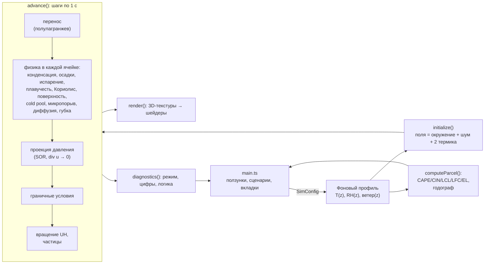

# StormLab (MeteoLAB): как устроен проект и полная история коммитов

> Этот документ описывает репозиторий **Bandananor/MeteoLAB** (приложение называется **StormLab**):
> что это за программа, как она работает изнутри, как развивалась от коммита к коммиту
> и чем каждый коммит отличается от **первого** (`df45d6a`) и **последнего** (`bb3a0e0`) состояния проекта.
>
> Документ составлен по содержимому git-истории ветки: 11 коммитов, сделанных 27 сентября 2026 года
> с 20:11 до 22:58 (UTC+3).

---

## Содержание

1. [Коротко о проекте](#1-коротко-о-проекте)
2. [Технологии и структура репозитория](#2-технологии-и-структура-репозитория)
3. [Принцип работы](#3-принцип-работы)
   - 3.1 [Общая схема](#31-общая-схема)
   - 3.2 [Расчётная область и сетка](#32-расчётная-область-и-сетка)
   - 3.3 [Переменные состояния](#33-переменные-состояния)
   - 3.4 [Фоновая атмосфера (окружение)](#34-фоновая-атмосфера-окружение)
   - 3.5 [Инициализация эксперимента](#35-инициализация-эксперимента)
   - 3.6 [Шаг модели: что происходит за 1 секунду модельного времени](#36-шаг-модели-что-происходит-за-1-секунду-модельного-времени)
   - 3.7 [Проекция давления](#37-проекция-давления)
   - 3.8 [Граничные условия](#38-граничные-условия)
   - 3.9 [Теория частицы: CAPE, CIN, LCL, LFC, EL](#39-теория-частицы-cape-cin-lcl-lfc-el)
   - 3.10 [Диагностика и классификация режима конвекции](#310-диагностика-и-классификация-режима-конвекции)
   - 3.11 [Вращение и мезоциклон (UH)](#311-вращение-и-мезоциклон-uh)
   - 3.12 [Визуализация](#312-визуализация)
   - 3.13 [Интерфейс и цикл кадра](#313-интерфейс-и-цикл-кадра)
4. [Хронология коммитов (сводная таблица)](#4-хронология-коммитов-сводная-таблица)
5. [Подробная история каждого коммита](#5-подробная-история-каждого-коммита)
6. [Сводная матрица возможностей по коммитам](#6-сводная-матрица-возможностей-по-коммитам)
7. [Первый коммит против последнего: итоговое сравнение](#7-первый-коммит-против-последнего-итоговое-сравнение)
8. [Метрики роста кода](#8-метрики-роста-кода)
9. [Выводы, известные ограничения и планы](#9-выводы-известные-ограничения-и-планы)

---

## 1. Коротко о проекте

**StormLab** — интерактивная 3D-песочница в браузере, в которой можно «вырастить» грозовое облако.
Пользователь задаёт погоду: температуру и влажность по слоям, ветер на разных высотах, тип
поверхности, время суток. Дальше упрощённая численная модель атмосферы сама решает, что получится:
лёгкие кучевые облака, одиночная гроза, кластер ячеек, микропорыв или вращающаяся суперячейка.

Главные свойства:

- **Это расчёт, а не анимация.** Облака появляются из уравнений движения воздуха, переноса тепла и влаги,
  поэтому каждый эксперимент уникален (а при одинаковом `seed` — воспроизводим).
- **Всё работает в браузере**, без сервера: физика считается на CPU в JavaScript, отрисовка — на GPU
  через WebGL 2 (Three.js).
- **Интерфейс и тексты на русском**, ориентированы на широкую аудиторию, но с «инструментами синоптика»:
  аэрологическая диаграмма, годограф, CAPE/CIN, спиральность восходящего потока.
- Лицензия — **MIT** (появилась в коммите `415e078`).

---

## 2. Технологии и структура репозитория

| Компонент | Версия / назначение |
|---|---|
| TypeScript | `~6.0.2`, строгие проверки неиспользуемых переменных, `noEmit` (типы проверяет `tsc`, собирает Vite) |
| Vite | `^8.1.1` — dev-сервер и сборка (`npm run dev`, `npm run build`, `npm run preview`) |
| Three.js | `^0.185.1` — сцена, камера `OrbitControls`, шейдеры, 3D-текстуры |
| Браузер | нужен WebGL 2 (3D-текстуры `sampler3D`) |

Структура на момент последнего коммита `bb3a0e0`:

```
MeteoLAB/
├── index.html            # корневая страница, подключает /src/main.ts
├── package.json          # скрипты dev / build / preview, зависимости
├── package-lock.json
├── tsconfig.json
├── .gitignore
├── LICENSE               # MIT (с коммита 415e078)
├── README.md             # описание для пользователей (переписано в 6df9b61)
├── roadmap.markdown      # план StormLab 2.0 (заменил ROADMAP.md из bb3a0e0, см. 5.12)
├── public/
│   ├── favicon.svg
│   └── icons.svg
└── src/
    ├── main.ts           # интерфейс: панели, ползунки, сценарии, диаграммы, цикл кадра
    ├── simulator3d.ts    # класс Atmosphere: физика модели + 3D-сцена
    ├── volumeShaders.ts  # GLSL-шейдеры: облака, тени, поля, осадки (с коммита 2383093)
    └── style.css         # оформление
```

Разделение ответственности:

- **`simulator3d.ts`** — «сердце»: класс `Atmosphere` хранит все поля модели, делает шаг по времени,
  считает диагностику и рисует сцену. Физика и отрисовка пока живут в одном классе (разделить их —
  первый пункт `ROADMAP.md`).
- **`volumeShaders.ts`** — вся GPU-часть: raymarching облаков, тени на земле, цветные срезы полей,
  объём сильных аномалий, спрайты снега и дождя.
- **`main.ts`** — DOM-интерфейс и связь с моделью: ползунки → `SimConfig`, вкладки → режим отображения,
  отрисовка аэрологической диаграммы и годографа на `<canvas>`, вывод цифр.

---

## 3. Принцип работы

### 3.1 Общая схема



Модель — сильно облегчённый аналог облакоразрешающих моделей (cloud-resolving models), которые используют
исследователи конвекции. Уравнения решаются в **приближении несжимаемой жидкости** с плавучестью
(похоже на приближение Буссинеска): скорость переносится, к вертикальной скорости добавляется сила
плавучести, а потом поле скорости «очищается» от дивергенции решением уравнения Пуассона для давления.

### 3.2 Расчётная область и сетка

| Параметр | Значение |
|---|---|
| Размер области | 48 × 36 × 15 км (`W`, `D`, `H`) |
| Сетка | 40 × 32 × 24 узла = **30 720 ячеек** (`NX`, `NY`, `NZ`) |
| Шаг по горизонтали | Δx = 1,2 км, Δy = 1,125 км |
| Шаг по вертикали | Δz = 15 км / 23 ≈ 0,652 км |
| Шаг по времени | Δt = 1 с (`DT`) |
| Ускорение времени | ползунок «Ускорение времени» 1–30× (по умолчанию 8×); за кадр не больше 12 шагов |

Массивы хранятся плоско (`Float32Array` длиной `N`), индекс `i = x + NX·(y + NY·z)`.
По горизонтали область **периодична** (что ушло за восточный край, приходит с западного).

Система координат сцены (исправлена в `5bf46fa`): +X — восток, +Y — вверх, **−Z — север**.
Модельная координата `y` (север) переводится в мир как `z_world = D/2 − y`.

### 3.3 Переменные состояния

| Массив | Смысл | Единицы |
|---|---|---|
| `u`, `v`, `w` | компоненты скорости ветра (восток, север, вверх) | м/с |
| `theta` | потенциальная температура θ | K |
| `q` | удельная влажность (водяной пар) | кг/кг |
| `cloud` | облачная вода | кг/кг |
| `rain` | дождевая вода (осадки) | кг/кг |
| `cold` | «индикатор» холодного бассейна: накопленное испарительное охлаждение | K |
| `pressure` | возмущение давления из проекции (кинематическое) | — |
| `surfacePattern` | 2D-шум неоднородности нагрева поверхности | — |

### 3.4 Фоновая атмосфера (окружение)

Окружение задаётся ползунками и определяет всё: начальное состояние, плавучесть, теорию частицы.

- **Температура** `temperatureEnv(z)` — кусочно-линейная: градиент `lapseLow` в слое 0–3 км,
  `lapseMid` в 3–8 км, `lapseUpper` от 8 км до тропопаузы, выше — потепление `stratoWarming`.
- **Давление** — барометрическая формула `p(z) = 101325·exp(−z/8000)`.
- **Потенциальная температура** `θ = T·(100000/p)^κ`, κ = 0,286.
- **Насыщение** — формула Магнуса (в варианте Болтона): `e_s = 611,2·exp(17,67·T/(T+243,5))`,
  `q_s = 0,622·e_s/(p − e_s)` с ограничением 0…0,045.
- **Влажность** `rhEnv(z)` — линейная интерполяция RH между уровнями 0 / 1,5 / 5 км / тропопауза,
  в стратосфере 70 % от `rhUpper`; `q_env = RH·q_s`.
- **Ветер** — скорость и направление задаются на 0, 3, 6 и 10 км и интерполируются линейно;
  направление метеорологическое («откуда дует»), поэтому `angle = 270° − dir`.

С коммита `3dba857` все эти профили один раз **табулируются по уровням модели** (`computeEnv()`,
объект `env` с массивами `p`, `exner`, `theta`, `q`, `u`, `v`), потому что окружение меняется только
при перезапуске. До этого они пересчитывались для каждой ячейки на каждом шаге.

### 3.5 Инициализация эксперимента

`initialize()`:

1. Строит `surfacePattern` — «случайное блуждание» по строкам сетки (`walk = walk·0,82 + шум`),
   чтобы поверхность грелась неравномерно и термики стартовали в разных местах.
2. Заполняет все ячейки фоновыми значениями: `u,v` = ветер окружения, `w = 0`,
   `θ = θ_env + крошечный шум (±0,009 K)`, `q = q_env`, облака/дождь/cold pool = 0.
3. Вбрасывает **два тёплых влажных пузыря** (`injectBubble`) в точках (0,38·W; 0,45·D) и (0,61·W; 0,57·D)
   с силой 1 и 0,72. Каждый пузырь — гауссиана радиусом ~4,2 км по горизонтали и ~1,8 км по вертикали,
   добавляющая до +3,2 K к θ, +3 г/кг к `q` и +1,1 м/с к `w`.
   С коммита `3dba857` сила пузырей умножается на параметр `bubble` (ползунок «Сила начального термика»).

Двойной клик по земле (`perturb`) бросает луч из камеры, находит точку на земле и вбрасывает туда
такой же пузырь силой 1,25.

Генератор случайных чисел — `mulberry32(seed)`, поэтому эксперимент с тем же `seed` повторяется.

### 3.6 Шаг модели: что происходит за 1 секунду модельного времени

`advance(realDt)` накапливает реальное время × ускорение и выполняет целые шаги `step(1 с)`.
Порядок операций внутри `step` (в финальной версии):

**1. Перенос (адвекция), полулагранжева схема.**
Для каждой ячейки ищется точка, откуда воздух пришёл за Δt (`x − u·Δt/Δx` и т. д.), и значение
берётся трилинейной интерполяцией. Схема безусловно устойчива при любом числе Куранта, но численно
размывает поля.

- Дождь переносится отдельно с учётом падения: вертикальная скорость `w − 7 м/с` (`RAIN_FALL`).
- Для остальных полей (`u, v, w, θ, q, cloud, cold`) с коммита `3dba857` один раз вычисляется
  **общая траектория назад** (`computeBacktrace`: 8 индексов углов + 3 веса на ячейку), и все поля
  переносятся одной и той же скоростью «до шага». Небольшие множители затухания (`w·0,9995`,
  `cloud·0,99995`, `cold·0,9992`) играют роль простой диссипации.

**2. Физика в каждой ячейке** (один проход по сетке):

| Процесс | Формула / смысл |
|---|---|
| Конденсация | если `q > q_s`: 32 %/с избытка пара переходит в `cloud`, θ растёт на `L_v/c_p/Π · Δq` (скрытая теплота) |
| Испарение облака | если RH < 1: облако испаряется со скоростью ∝ `entrainment·(1−RH)`; охлаждение θ, часть идёт в `cold` (×0,14) — это эффект вовлечения сухого воздуха |
| Автоконверсия | облачная вода выше порога 0,9 г/кг превращается в дождь со скоростью 3,5 %/с × `precipEfficiency` |
| Испарение дождя | в ненасыщенном воздухе дождь испаряется ∝ `(q_s−q)·evaporation`; охлаждение × `coldPoolStrength` целиком идёт в `cold` — так рождается холодный бассейн |
| Плавучесть | `B = (θ−θ_env)/θ_env + 0,61·(q−q_env) − 1,8·cloud − 2,5·rain`, `w += g·B·Δt` — тёплый и влажный воздух всплывает, облачная и дождевая вода «нагружают» его |
| Кориолис | поворачивает **отклонение** ветра от фонового: `u' += f·v'Δt`, `v' −= f·u'Δt`, `f = 2Ω·sin(широта)` |
| Затухание отклонения | с `3dba857`: `u = u_env + 0,9999·(u − u_env)` — гасится только возмущение, а не весь ветер |
| Поверхность | в двух нижних уровнях добавляются тепловой и влажностный потоки от солнца, зависящие от типа поверхности, влажности почвы и `surfacePattern` |
| Cold pool / gust front | ниже `min(3,2 км, LFC)`: горизонтальный градиент `cold` даёт подъём на краю бассейна (фронт порывов), а в «ядре» бассейна ниже 1,3 км — опускание |
| Микропорыв | в нижних уровнях при `w < −5 м/с` и заметном дожде: радиальный отток у земли, усиление `cold`, запоминается сила оттока `microburstOutflow` |
| Субсеточная турбулентность | θ и `q` слегка смешиваются с 4 горизонтальными соседями (коэффициент ∝ `turbulence`) |
| Губка | выше `max(тропопауза + 1,6 км, 13 км)` всё плавно притягивается к окружению, `w` гасится — чтобы волны не отражались от «крышки» |

Параметры поверхностей (`surface()`):

| Тип | Альбедо | Доля явного тепла | Испарение | «Инерция» |
|---|---|---|---|---|
| Трава | 0,20 | 0,42 | 0,75 | 0,65 |
| Сухая почва | 0,30 | 0,72 | 0,15 | 0,45 |
| Вода | 0,08 | 0,18 | 1,25 | 1,80 |
| Город | 0,16 | 0,78 | 0,08 | 0,80 |

Инсоляция: `solarMax · max(0, sin(π·(час − 6)/12))` — солнце светит с 6:00 до 18:00, время суток
идёт вместе с модельным временем.

**3. Проекция давления** (см. 3.7) делает поле скорости бездивергентным.

**4. Граничные условия у земли и наверху**: `w = 0` на нижнем и верхнем уровнях, у земли горизонтальный
ветер умножается на 0,94 (грубое трение).

**5. Вспомогательное**: движение 10 000 частиц-трассеров (с `3dba857` — только если включены
«Потоки»), частиц снега/дождя (если включён режим), расчёт спиральности `updateRotation`.

### 3.7 Проекция давления

Чтобы воздух не «сжимался», из скорости вычитается градиент давления, найденного из уравнения Пуассона:

```
∇²p = (∇·u) / Δt,      u ← u − Δt·∇p
```

- Дивергенция и градиент считаются центральными разностями.
- Уравнение решается итерациями: **16 итераций за шаг**.
- В первом коммите: давление каждый шаг обнулялось (холодный старт), итерации без
  сверхрелаксации, а на земле стояло условие `p = 0`.
- С коммита `3dba857`: **SOR** (последовательная верхняя релаксация, ω = 1,7), **тёплый старт**
  (давление с прошлого шага используется как начальное приближение — это корректно, потому что Δt
  постоянен) и условие **∂p/∂z = 0 у земли** (`p[z=0] = p[z=1]`), согласованное с `w = 0`.
  Наверху остаётся `p = 0` под губкой.
- После проекции скорости ограничиваются: |u|, |v| ≤ 85 м/с, |w| ≤ 60 м/с.

### 3.8 Граничные условия

| Граница | Условие |
|---|---|
| Бока (x, y) | периодические; с `3dba857` — через готовые таблицы соседей `XP/XM/YP/YM` вместо `mod()` |
| Земля | `w = 0`, трение `u,v × 0,94`, давление ∂p/∂z = 0 (с `3dba857`; раньше p = 0) |
| Верх | `w = 0`, давление p = 0, поглощающий слой (губка) над тропопаузой |

### 3.9 Теория частицы: CAPE, CIN, LCL, LFC, EL

`computeParcel()` поднимает воображаемую частицу воздуха от земли шагами по 100 м
(один раз при запуске эксперимента):

1. Старт: `T = T_земли + 0,5 K`, влажность — как у земли.
2. Пока частица не насыщена — сухоадиабатическое охлаждение 9,8 K/км; первая высота насыщения — **LCL**.
3. После насыщения — влажноадиабатический градиент (формула с учётом скрытой теплоты).
4. На каждом шаге частица немного смешивается с окружением (∝ `entrainment`).
5. Плавучесть — по виртуальной температуре `T_v = T·(1 + 0,61·q)`.
6. **LFC** — первая высота выше LCL, где плавучесть > 0; **EL** — где она снова ≤ 0 (не ближе 200 м от LFC).
7. **CAPE** — интеграл положительной плавучести между LFC и EL, **CIN** — отрицательной ниже LFC.

С коммита `4d91291` та же функция возвращает ещё **точку росы окружения**, **уровень 0 °C** и
**профиль ветра 0–10 км** (через 250 м) для годографа.

### 3.10 Диагностика и классификация режима конвекции

`diagnostics()` каждый кадр проходит по всей сетке и находит максимумы: восходящий и нисходящий поток,
«интенсивность осадков» (proxy: `rain·12000` мм/ч), вершину облака (`cloud > 0,07 г/кг`), вершину
термика (`w > 0,6 м/с`), облачную воду, cold pool ниже 1,5 км.

`countCores()` строит 2D-маску колонн, где на высотах уровней 3–10 есть одновременно `w > 2 м/с` и облако,
и считает связные области (заливкой) — это число **updraft-ядер**.

Правила классификации (порядок важен):

| Условие | Режим |
|---|---|
| Мезоциклон держится ≥ 10 мин (с `3dba857`) | **Суперячейка с мезоциклоном** |
| cold pool > 7 K и updraft < 2 м/с | Outflow-dominant |
| ядер ≥ 3 | 3D-мультиячейка |
| ядер = 2 | Две взаимодействующие ячейки |
| 1 ядро и сдвиг 0–6 км > 18 м/с | Наклонённая организованная ячейка |
| 1 ядро | Одиночная 3D-ячейка |
| вершина облака > 1 км | Развивающийся 3D cumulus |
| иначе | Термики пограничного слоя |

Текст «Логика» собирается из фраз по стадиям: достигнуты ли LCL, LFC, EL, есть ли cold pool,
микропорыв, вращение, антициклонический поток (признак расщепления ячейки).

### 3.11 Вращение и мезоциклон (UH)

Добавлено в `3dba857`. Для каждой колонны считается **спиральность восходящего потока**
(updraft helicity):

```
UH = Σ_{z = 2..5 км} w · ζ · Δz,     ζ = ∂v/∂x − ∂u/∂y  (вертикальная завихренность)
```

Пороги откалиброваны под грубую (~1 км) и диффузную сетку:

| Константа | Значение | Смысл |
|---|---|---|
| `UH_ROTATING` | 100 м²/с² | поток вращается — появляется серое кольцо-маркер |
| `UH_MESOCYCLONE` | 150 м²/с² | порог мезоциклона |
| `MESO_PERSISTENCE` | 600 с | порог должен держаться 10 минут подряд → кольцо становится янтарным, режим «Суперячейка» |

Также отслеживается минимальный (отрицательный) UH — сильный антициклонический поток говорит о
расщеплении шторма на правую и левую ячейки.

### 3.12 Визуализация

**Облака (с `2383093`).** Поля `cloud` и `rain` каждый кадр упаковываются в 8-битную 3D-текстуру
формата RG (`updateVolume`). Куб области рисуется с обратными гранями, а фрагментный шейдер
`volumeFragment` для каждого пикселя:

1. пересекает луч камеры с коробкой области (`boxHit`);
2. делает 96 шагов с джиттером (чтобы не было полос);
3. в каждой точке берёт плотность, добавляет **fbm-шум** (размывание краёв ниже разрешения сетки —
   «кучевая» текстура), считает ослабление по **закону Бугера–Ламберта**;
4. освещение от солнца — 5 шагов к солнцу (**самозатенение**), фазовая функция **Хеньи–Гринстейна**
   (смесь вперёд g = 0,55 и назад g = −0,2), «**powder effect**» (затемнение тонких краёв);
5. дождь — сероватая среда; в конце — экспоненциальный туман по средней глубине.

**Тени на земле (с `014a06f`).** В стандартный материал земли через `onBeforeCompile` внедряется
функция `cloudShadow`: 24 шага по лучу к солнцу через ту же 3D-текстуру. Тень гасит только прямой
солнечный свет (`directDiffuse`, `directSpecular`), а рассеянный свет неба остаётся — тени мягкие и
реалистичные.

**Солнце (с `5bf46fa`).** Направление вычисляется по местному времени и широте для равноденствия
(склонение 0): восход в 6:00, закат в 18:00 — согласовано с формулой инсоляции. Низкое солнце даёт
тёплый (оранжевый) свет, ночью свет гаснет, остаётся тусклый рассеянный.

**Поля (с `5bf46fa`).** Вкладки «Вертикальные потоки», «Температура», «Влажность», «Завихренность»,
«Вращение (UH)» (с `3dba857`), «Cold pool»:

- значение поля нормируется в диапазон из таблицы `FIELDS` и пишется в 8-битную 3D-текстуру;
- **два подвижных среза** (горизонтальный по высоте и вертикальный «север ↔ юг») окрашиваются
  по цветовой шкале, с изолиниями и тёмной **нулевой линией** для знакопеременных полей;
- **объём сильных аномалий** (`fieldVolumeFragment`): светятся только значения далеко от нейтрали;
- лучи объёмов обрываются на срезах (`clipToSlices`), так как срезы непрозрачны, а объёмы рисуются
  без теста глубины;
- облака в режиме поля остаются полупрозрачными (22 %).

| Поле | Диапазон | Шкала |
|---|---|---|
| Вертикальная скорость | −15…+15 м/с | расходящаяся (синий–белый–красный) |
| Отклонение температуры | −4…+4 K | расходящаяся |
| Относительная влажность | 0…100 % | коричневый → бирюзовый |
| Вертикальная завихренность | −4…+4 ·10⁻³ с⁻¹ | расходящаяся |
| UH 2–5 км | −300…+300 м²/с² | расходящаяся |
| Cold pool | 0…8 K | белый → тёмно-синий |

**Снег и дождь (с `4d91291`).** Кнопка «Снег и дождь» включает до 8000 частиц, рождающихся в ячейках
с заметным `rain`. Выше уровня 0 °C частица рисуется снежинкой (шейдер с шестью «лучами») и падает
со скоростью 2 м/с; в слое 600 м ниже нулевой изотермы она тает, превращаясь в вытянутую голубую
каплю со скоростью 7 м/с. Если дождь в точке испарился, частица исчезает. Это **чисто визуальный**
эффект: льда в модели нет, фаза определяется только высотой относительно 0 °C.

**Потоки.** 10 000 лагранжевых частиц (оранжевые — вверх, синие — вниз) и сетка 3D-векторов скорости.

### 3.13 Интерфейс и цикл кадра

- Левая панель: сценарии, группы ползунков (температура, влажность, ветер, 3D-динамика, поверхность,
  микрофизика, расчёт), кнопки «Перезапустить» и «Пауза».
- Изменение профиля (ключи из `resetKeys`) **перезапускает** эксперимент; остальные параметры
  (ускорение, турбулентность, микрофизика) меняются «на лету».
- Правая панель: режим конвекции, аэрологическая диаграмма, уровни, годограф, CAPE/CIN, метрики, «Логика».
- `frame()` через `requestAnimationFrame`: `advance` → `render` → `diagnostics` → обновление текста;
  диаграмма и годограф перерисовываются раз в 20 кадров.
- Состояние отображения (`view`: вкладка, потоки, осадки, срезы) хранится отдельно от модели и
  переносится в новую модель при перезапуске (с `5bf46fa`).

---

## 4. Хронология коммитов (сводная таблица)

| № | Хеш | Время (UTC+3) | Заголовок | Файлы (+/−, без lock-файла) |
|---|---|---|---|---|
| 1 | `df45d6a` | 20:11:18 | Initial commit: StormLab 3D atmospheric convection simulator | 10 файлов, +430 |
| 2 | `2383093` | 20:24:19 | Render clouds with volumetric raymarching | 3 файла, +149 / −9 |
| 3 | `6df9b61` | 20:24:46 | Rewrite README for a general audience | 1 файл, +101 / −43 |
| 4 | `084b38b` | 20:33:57 | Add one-click weather scenario presets | 2 файла, +42 / −13 |
| 5 | `415e078` | 20:33:57 | Add MIT license and document scenario presets | 2 файла, +42 / −14 |
| 6 | `014a06f` | 20:54:57 | Cast cloud shadows onto the ground | 2 файла, +45 / −18 |
| 7 | `5bf46fa` | 21:11:24 | Show fields as 3D slices and volumes; move the sun with time of day | 4 файла, +228 / −50 |
| 8 | `0f3f5ef` | 21:11:24 | Describe field slices and moving sun in README | 1 файл, +6 / −3 |
| 9 | `4d91291` | 21:29:50 | Add hodograph, richer sounding and snow-to-rain precipitation view | 5 файлов, +143 / −20 |
| 10 | `3dba857` | 22:50:09 | Fix wind-shear erosion and pressure BC, speed up core 7x, detect mesocyclones | 3 файла, +134 / −32 |
| 11 | `bb3a0e0` | 22:58:15 | Add StormLab 2.0 roadmap | 1 файл, +45 |

Автор всех коммитов — **Bandananor**. В трейлерах коммитов указано соавторство ИИ-ассистента
(в первом коммите — одна модель Claude, в остальных — другая).
Вся история уложилась примерно в **2 часа 47 минут**.

Условно историю можно разбить на этапы:

```mermaid
timeline
    title Развитие StormLab 27.09.2026
    20:11 : df45d6a Первая версия: физика + точечные облака
    20:24 : 2383093 Объёмные облака (raymarching)
          : 6df9b61 README для широкой аудитории
    20:34 : 084b38b Сценарии погоды
          : 415e078 Лицензия MIT
    20:55 : 014a06f Тени облаков на земле
    21:11 : 5bf46fa Срезы и объёмы полей, движущееся солнце
          : 0f3f5ef README
    21:30 : 4d91291 Годограф, диаграмма, снег и дождь
    22:50 : 3dba857 Исправления физики, ускорение 7×, мезоциклоны
    22:58 : bb3a0e0 План StormLab 2.0
```

---

## 5. Подробная история каждого коммита

Для каждого коммита приведены: что и зачем изменено, технические детали, а также два сравнения —
**с первым коммитом** (`df45d6a`, «точка отсчёта») и **с последним** (`bb3a0e0`, «итоговое состояние»).
Сравнение «с последним» отвечает на вопрос: *чего в этой версии ещё не хватает до финала?*

---

### 5.1 Коммит 1 — `df45d6a` · Initial commit: StormLab 3D atmospheric convection simulator

**Дата:** 27.09.2026 20:11:18 · **Файлы:** `.gitignore`, `README.md`, `index.html`, `package.json`,
`package-lock.json`, `public/favicon.svg`, `public/icons.svg`, `src/main.ts` (151 строка),
`src/simulator3d.ts` (111 строк), `src/style.css`, `tsconfig.json`.

**Описание из коммита:** собственная CFD-песочница на TypeScript/Three.js для облачной конвекции:
полулагранжев перенос, несжимаемая проекция давления, Кориолис, балк-микрофизика, динамика cold pool
и фронта порывов, диагностика по теории частицы (CAPE/CIN/LCL/LFC/EL). Удалены неиспользуемый
2D-прототип и шаблон Vite.

**Что уже было в первой версии:**

- Вся расчётная модель: сетка 40 × 32 × 24, 8 прогностических полей, конденсация, автоконверсия,
  испарение облака и дождя, плавучесть с нагрузкой гидрометеорами, Кориолис, поток тепла и влаги от
  поверхности 4 типов, cold pool и фронт порывов, микропорыв, субсеточное перемешивание, губка.
- Проекция давления: 16 итераций Гаусса–Зейделя (в месте), давление обнулялось каждый шаг, `p = 0` у земли.
- Перенос: функция `advect()` вызывалась по очереди для `u`, `v`, `w`, `θ`, `q`, `cloud`, `rain`, `cold`
  — **каждая следующая переменная переносилась уже изменённой скоростью** (например, `v` — новым `u`).
- Затухание `advect(u, dt, 0,9999)` действовало на **полный** ветер, а не на отклонение.
- Индексация везде через `this.idx(x,y,z)` с `mod()`, профили окружения (`thetaEnv`, `qEnv`, `windUV`,
  `pressureAt`) считались заново в каждой ячейке на каждом шаге.
- **Облака — точечные спрайты**: до 14 000 размытых точек (1–3 на облачную ячейку), обновление раз в 3 кадра.
- **Поля — облако цветных точек** на каждом втором узле (20 × 16 × 12 = 3840 точек): абсолютная
  температура, RH, модуль 3D-завихренности |ω|, cold pool.
- Солнце — **неподвижное**, в точке (−25, 45, 18).
- Правая панель: режим (7 типов), CAPE/CIN, LCL/LFC/EL, метрики, «Логика»; аэрологическая
  диаграмма 216 × 190 px с двумя линиями (среда и частица).
- 29 ползунков (плюс селектор поверхности) без сценариев, «Потоки» (частицы + векторы).
- README — технический список возможностей и **путь запуска на локальной Windows-машине**
  (`cd C:\Users\...\outputs\stormlab`).

**Скрытые недочёты этой версии**, исправленные позже:

| Недочёт | Где исправлен |
|---|---|
| Сцена зеркальна: север модели ↦ +Z мира, двойной клик попадал в зеркальную точку | `5bf46fa` |
| `recreate()` передавал модели **копию** конфигурации `{...config}` → после перезапуска «живые» ползунки переставали действовать | `5bf46fa` |
| При перезапуске сбрасывалась выбранная вкладка (переносился только `showVectors`) | `5bf46fa` |
| Затухание размывало фоновый сдвиг ветра ≈ на 30 % в час (0,9999³⁶⁰⁰ ≈ 0,70) | `3dba857` |
| Условие `p = 0` у земли противоречило `w = 0` | `3dba857` |
| Поля переносились разными скоростями (порядок вызовов влиял на результат) | `3dba857` |
| Частицы потоков считались каждый шаг, даже если скрыты | `3dba857` |
| `dispose()` не освобождал геометрии и материалы | частично `2383093`, полностью `5bf46fa`/`4d91291` |

**Сравнение с первым коммитом:** это и есть точка отсчёта.

**Сравнение с последним коммитом (`bb3a0e0`):** в первой версии нет объёмных облаков, теней,
движущегося солнца, срезов полей, вкладок вертикальной скорости и UH, сценариев, годографа, CAPE/CIN-заливки,
точки росы, уровня 0 °C, снега и дождя, детекции мезоциклона, ползунка силы термика, лицензии,
понятного README и плана развития. Ядро модели на 3 известных физических ошибки «грязнее» и примерно
в 7 раз медленнее. Исходники `src/` весят 47,1 КБ против 84,8 КБ в финале.

---

### 5.2 Коммит 2 — `2383093` · Render clouds with volumetric raymarching

**Дата:** 20:24:19 (через 13 минут после первого) · **Изменения:** `src/main.ts` (+1/−1),
`src/simulator3d.ts` (+15/−8), **новый** `src/volumeShaders.ts` (+133).

**Что сделано:**

- Точечные облака (`cloudGeometry`, `cloudPoints`, `updateClouds`, константа `MAX_CLOUD_POINTS`)
  **удалены** и заменены объёмным рендерингом.
- Добавлена 3D-текстура `Data3DTexture` 40 × 32 × 24, формат RG, 8 бит: канал R — облачная вода
  (нормировка `(cloud − 0,03 г/кг)/1,4 г/кг`), канал G — дождь (`rain/2,5 г/кг`).
  Текстура обновляется **каждый кадр** (раньше точки — раз в 3 кадра).
- Новый файл шейдеров: `volumeVertex`, `volumeFragment` с raymarching (96 шагов), световыми лучами
  (5 шагов по 0,6 км), законом Бугера–Ламберта, двойной фазовой функцией Хеньи–Гринстейна,
  powder-эффектом, fbm-эрозией, туманом. Эти принципы сохранились до финала.
- Константа `SUN_POSITION = (−25, 45, 18)` — солнце всё ещё неподвижно, но теперь его направление
  передаётся и в шейдер облаков.
- В легенду добавлен пункт «осадки»; частицы потоков рисуются после облаков (`renderOrder = 2`).
- `dispose()` теперь освобождает текстуру, материал и геометрию объёма.

**Зачем:** точечные спрайты давали «пушистый шум» без освещения и объёма; raymarching показывает
плотные тёмные основания, освещённые вершины и серые полосы дождя — облако выглядит как облако.

**Сравнение с первым коммитом:** главный визуальный скачок проекта. Физика не менялась ни в одном
символе — отличается только способ показа облаков. Поля (вкладки) по-прежнему — точки.

**Сравнение с последним коммитом:** шейдер облаков в финале почти тот же, но в нём добавлены:
общий модуль `volumeCommon`, цвет рассеянного света, зависящий от времени суток (`uAmbientTop/Bottom`),
прозрачность `uOpacity` для режима полей, обрезка лучей срезами, тени на земле, шейдеры полей и осадков.
Нет ещё движения солнца, теней, сценариев и всех исправлений физики.

---

### 5.3 Коммит 3 — `6df9b61` · Rewrite README for a general audience

**Дата:** 20:24:46 (через 27 секунд после предыдущего) · **Изменения:** `README.md` (+101/−43).

**Что сделано:** README полностью переписан для широкой аудитории.

| Было (df45d6a) | Стало (6df9b61) |
|---|---|
| Заголовок «StormLab 1.0 3D» | «StormLab — гроза у тебя в браузере» |
| Запуск через `cd C:\Users\...` (локальный путь автора) | `git clone` → `npm install` → `npm run dev`, требования Node.js 20+ и WebGL 2 |
| Список терминов: «semi-Lagrangian 3D-адвекция», «несжимаемая проекция» | Разделы «Что можно делать», «Быстрый старт», «Управление» (таблица), «Стартовые эксперименты», «Что означают цифры справа», «Как это устроено», «Ограничения», «Для разработчиков» |
| Нет объяснения CAPE/LCL и т. п. | Каждая величина объяснена простыми словами |

**Сравнение с первым коммитом:** код идентичен коммиту 2; документация стала пригодной для
постороннего человека (в первом коммите README фактически не позволял запустить проект на чужой машине).

**Сравнение с последним коммитом:** финальный README сохраняет эту структуру, но: раздел
«Стартовые эксперименты» заменён таблицей «Готовые сценарии» (коммит 5), добавлены срезы полей и
движущееся солнце (коммит 8), снег/дождь и годограф (коммит 9), UH/мезоциклон и сценарий «Суперячейка»
(коммит 10), раздел «Лицензия» (коммит 5).

---

### 5.4 Коммит 4 — `084b38b` · Add one-click weather scenario presets

**Дата:** 20:33:57 · **Изменения:** `src/main.ts` (+41/−13), `src/style.css` (+1).

**Что сделано:**

- Значения по умолчанию вынесены в объект `defaults`; конфигурация создаётся как `{...defaults}`.
- Массив `presets` из **6 сценариев**; каждый — небольшой набор переопределений поверх `defaults`:

| Сценарий | Переопределения |
|---|---|
| Летний день | — (исходные настройки) |
| Мощная гроза | T = 34 °C, RH 80/70/55 %, градиент 0–3 км 9 K/км |
| Сухой воздух | RH 3–7 км = 10 %, выше = 10 % |
| Сдвиг ветра | T = 32 °C, RH = 78 %, ветер 18/40/50 м/с на 3/6/10 км |
| Микропорыв | T = 33 °C, RH 55/35 %, градиент 9,5 K/км, испарение 2×, cold pool 2,5×, осадки 1,4× |
| Жаркий город | поверхность «город», почва 15 %, T = 33 °C, инсоляция 1000 Вт/м² |

- Нажатие: `Object.assign(config, defaults, {speed: config.speed}, preset.values)` — **ускорение
  времени сохраняется**, все ползунки и селектор поверхности синхронизируются (`showOutput`),
  эксперимент перезапускается и снимается пауза.
- Активный сценарий подсвечивается (`markPreset`); ручное изменение профиля снимает подсветку.
- В CSS — сетка кнопок сценариев.

**Сравнение с первым коммитом:** появился «вход без ползунков» — одно нажатие вместо настройки
десятка параметров. Физика и визуализация — как в коммите 2.

**Сравнение с последним коммитом:** в финале **7 сценариев** — добавлена откалиброванная
«Суперячейка» (коммит 10) между «Микропорывом» и «Жарким городом»; `defaults` получили поле `bubble: 1`.
Остальные 6 сценариев не менялись (в `ROADMAP.md` прямо сказано, что они сознательно оставлены с
экстремальной CAPE 5–9 тыс. Дж/кг).

---

### 5.5 Коммит 5 — `415e078` · Add MIT license and document scenario presets

**Дата:** 20:33:57 (та же секунда, что и коммит 4) · **Изменения:** **новый** `LICENSE` (+21),
`README.md` (+21/−14).

**Что сделано:**

- Добавлена лицензия **MIT**.
- В README раздел «Стартовые эксперименты» заменён на «Готовые сценарии» с таблицей
  «Сценарий → Что увидишь»; добавлен раздел «Лицензия».

**Сравнение с первым коммитом:** у проекта появился юридический статус открытого кода
(в первом коммите лицензии не было — формально код нельзя было свободно переиспользовать).

**Сравнение с последним коммитом:** `LICENSE` с тех пор не менялся. Таблица сценариев в финальном
README дополнена строкой «Суперячейка».

---

### 5.6 Коммит 6 — `014a06f` · Cast cloud shadows onto the ground

**Дата:** 20:54:57 · **Изменения:** `src/simulator3d.ts` (+9/−3), `src/volumeShaders.ts` (+36/−15).

**Что сделано:**

- Общая часть шейдеров вынесена в `volumeCommon` (униформы коробки, сетки, солнца, функция `toTex`)
  и `cloudSampling` (чтение текстуры плотности), чтобы переиспользовать её в материале земли.
- Новый фрагмент `groundShadowPars` с функцией `cloudShadow(p)`: 24 шага от точки земли к солнцу,
  оптическая толщина = облако + 0,3 × дождь, пропускание `exp(−od·ds·extinction·0,8)`.
- Стандартный `MeshStandardMaterial` земли модифицируется через `onBeforeCompile`: в вершинный
  шейдер добавляется мировая позиция, во фрагментный — умножение **только прямого** света на тень.
- Униформа `uShadowStrength`: тень включена, только когда видны облака (в режиме полей облака были
  скрыты, поэтому и тень выключалась).

**Зачем:** тени «привязывают» облака к земле — видно, где под облаком прохладнее, и сразу понятна
высота и размер облака.

**Сравнение с первым коммитом:** земля перестала быть плоской однотонной плоскостью, освещение
согласовано с облаками. Физика не менялась.

**Сравнение с последним коммитом:** в финале `uShadowStrength` удалён — тень работает всегда, потому
что облака в режиме полей не прячутся, а становятся полупрозрачными; униформы разделяются через
объект `shared`, а направление солнца меняется со временем суток (тени удлиняются к вечеру).

---

### 5.7 Коммит 7 — `5bf46fa` · Show fields as 3D slices and volumes; move the sun with time of day

**Дата:** 21:11:24 · **Изменения:** `src/main.ts` (+38/−9), `src/simulator3d.ts` (+74/−21),
`src/style.css` (+1), `src/volumeShaders.ts` (+115/−20). Самый крупный коммит по визуализации.

**Что сделано — поля:**

- Облако цветных точек (`fieldGeometry`, `fieldPoints`, `updateField`, `vorticity()`) удалено.
- Новая таблица `FIELDS` (название, единицы, диапазон, тип шкалы, порог, цвета) и тип `ScalarField`.
- Поля стали **физически осмысленными аномалиями**:

| Вкладка | Было (df45d6a) | Стало (5bf46fa) |
|---|---|---|
| Температура | абсолютная T, −65…+40 °C | **отклонение** T от окружения, ±4 K |
| Завихренность | модуль 3D-вектора |ω| (всегда ≥ 0) | **знаковая** вертикальная ζ, ±4·10⁻³ с⁻¹ (видно направление вращения) |
| Влажность | RH, условная раскраска | RH 0–100 % с цветовой шкалой |
| Cold pool | смесь аномалии θ и `cold` | `cold` 0–8 K |
| Вертикальные потоки | — | **новая** вкладка, w ±15 м/с |

- Два **подвижных среза** (горизонтальный 0,1–14,5 км, вертикальный ±17,5 км север–юг), цветовая
  шкала через 1D-текстуру (`colormapTexture`), изолинии (`fwidth`) и нулевая линия.
- **Объём сильных аномалий** (`fieldVolumeFragment`, 72 шага), флажок «Объём сильных отклонений».
- Лучи облаков и объёма поля обрываются на срезах (`clipToSlices`).
- Панель поля в окне: заголовок, цветовая шкала с подписями, ползунки срезов.
- Облака в режиме поля видны на 22 % прозрачности.

**Что сделано — солнце:**

- `sunDirection()`: солнце по часовому углу и широте для равноденствия; `updateSun()` каждый кадр
  меняет направление и цвет солнца, цвета рассеянного света неба сверху/снизу, яркость
  `HemisphereLight` и `DirectionalLight`. На низком солнце свет тёплый, ночью — почти темно.
- В строке состояния — высота солнца над горизонтом или «ночь».

**Исправленные ошибки:**

1. **Зеркальная сцена.** Север модели отображался в +Z; теперь `z_world = D/2 − y`
   (исправлено в частицах, векторах, `perturb` и шейдерном `toTex`).
2. **Живые ползунки после перезапуска.** `recreate()` передавал копию `{...config}`; теперь модели
   передаётся тот же объект, поэтому ускорение, турбулентность и микрофизика снова действуют сразу.
3. **Сброс вкладки при перезапуске.** Введено состояние `view` и `setView()`; при создании новой
   модели оно переносится `Object.assign(new Atmosphere(...), view)`.

**Сравнение с первым коммитом:** из «точек разного цвета» вкладки превратились в научную
визуализацию срезов, как в профессиональных пакетах (например, в разрезах моделей CM1/WRF).
Исправлены две ошибки интерфейса, существовавшие с первого коммита, и зеркальность сцены.

**Сравнение с последним коммитом:** в финале добавится шестая вкладка «Вращение (UH)»
(с автоматической установкой среза на 3,5 км), частицы осадков и уровень 0 °C в сцене,
годограф; ядро физики ещё с ошибками и медленное.

---

### 5.8 Коммит 8 — `0f3f5ef` · Describe field slices and moving sun in README

**Дата:** 21:11:24 (та же секунда, что и коммит 7) · **Изменения:** `README.md` (+6/−3).

**Что сделано:** в разделе «Что можно делать» описано, что солнце движется по времени суток
(«утром и вечером свет тёплый, а тени длинные»), и что поля показываются на двух подвижных срезах
с цветовой шкалой, а сильные отклонения — цветным объёмом.

**Сравнение с первым коммитом:** документация соответствует новым возможностям; код как в коммите 7.

**Сравнение с последним коммитом:** финальный README дополнительно описывает UH, снег и дождь,
годограф и мезоциклон.

---

### 5.9 Коммит 9 — `4d91291` · Add hodograph, richer sounding and snow-to-rain precipitation view

**Дата:** 21:29:50 · **Изменения:** `README.md` (+6), `src/main.ts` (+65/−8),
`src/simulator3d.ts` (+42/−12), `src/style.css` (+3), `src/volumeShaders.ts` (+27).

**Что сделано — аэрологическая диаграмма:**

- Общая функция `prepareCanvas()` учитывает `devicePixelRatio` (чёткость на Retina) и размер из CSS
  вместо фиксированных 216 × 190.
- Шкалы: высота 0–15 км, температура −70…+45 °C с подписями.
- **Заливка CAPE** (красным, частица теплее среды между LFC и EL) и **CIN** (синим, ниже LFC).
- Новая линия **точки росы окружения** (`dewpoint()`, пунктир), штриховая линия **0 °C**.
- Горизонтальные метки LCL / LFC / EL с подписями.
- В панели уровней — новый пункт «0 °C».

**Что сделано — годограф:**

- Профиль ветра 0–10 км через 250 м рисуется на полярной диаграмме с кольцами через 10 м/с,
  цвет по слоям: 0–3 км (красный), 3–6 км (зелёный), 6–10 км (синий); точки на 0, 1, 3, 6, 10 км.
- **Сдвиг ветра 0–6 км** с подсказкой: < 10 м/с — одиночные ячейки, 10–20 — мультиячейки,
  > 20 — возможны суперячейки.

**Что сделано — снег и дождь:**

- Кнопка «Снег и дождь»; до 8000 частиц, рождающихся в ячейках с `rain > 0,3 г/кг`
  (вероятность ∝ количеству дождя).
- Частица переносится ветром модели и падает: снег 2 м/с выше 0 °C, в слое таяния 600 м
  скорость и вид плавно меняются, дождь — 7 м/с.
- Шейдеры `precipVertex/precipFragment`: снежинка с шестью лучами, капля — вытянутый эллипс;
  размер зависит от расстояния до камеры.
- Если дождь в точке испарился, частица исчезает — видно, как осадки «не долетают» до земли
  (virga). В сцене появляется сетка уровня 0 °C.
- `Sounding` стал интерфейсом: `profile` (с `dew`), `wind`, `cape`, `cin`, `lcl`, `lfc`, `el`, `freezing`.

**Сравнение с первым коммитом:** правая панель превратилась из «двух линий» в набор инструментов
синоптика (диаграмма с площадями энергии и годограф). Впервые видно не только облако, но и
жизненный путь осадков. Физика модели всё ещё не менялась с первого коммита.

**Сравнение с последним коммитом:** не хватает только коммита 10: исправлений физики,
ускорения, UH и мезоциклона, «Суперячейки» и ползунка силы термика. Интерфейс диаграмм уже финальный.

---

### 5.10 Коммит 10 — `3dba857` · Fix wind-shear erosion and pressure BC, speed up core 7x, detect mesocyclones

**Дата:** 22:50:09 (после самой длинной паузы — 80 минут) · **Изменения:** `README.md` (+6/−1),
`src/main.ts` (+10/−4), `src/simulator3d.ts` (+118/−27). **Единственный коммит, изменивший физику.**

По описанию коммита, изменения проверялись отдельным «безголовым» (headless) тестовым скриптом;
сам скрипт в репозиторий не добавлен (его включение в проект — пункт этапа 1 `ROADMAP.md`).

**Исправления физики:**

1. **Эрозия сдвига ветра.** Раньше `advect(u, dt, 0,9999)` гасил *весь* ветер, и заданный профиль
   сдвига таял примерно на 30 % в час — суперячейки, которым нужен сильный сдвиг, не могли выжить.
   Теперь `u, v` переносятся без затухания, а гасится только **отклонение от окружения**:
   `u = u_env + 0,9999·(u − u_env)`.
2. **Граничное условие давления.** У земли было `p = 0`, что противоречит непротеканию `w = 0`.
   Теперь **∂p/∂z = 0** (`p[0] = p[1]` на каждой итерации).
3. **Сходимость давления.** Итерации получили **сверхрелаксацию SOR (ω = 1,7)** и **тёплый старт**
   (давление не обнуляется между шагами) — те же 16 итераций дают гораздо более бездивергентное поле.
4. **Согласованный перенос.** Все поля (кроме падающего дождя) переносятся **одной и той же
   скоростью до шага** через общую траекторию назад. Дождь переносится первым, тоже скоростью до шага.

**Ускорение ядра ~7×** (в `ROADMAP.md` итог — шаг модели ~23 мс):

- профили окружения табулируются один раз на уровень (`computeEnv`, `env`);
- прямые индексы соседей по периодическим таблицам `XP/XM/YP/YM` вместо `idx()` с `mod()`;
- быстрая функция `sample()` без вызовов `idx()`;
- одна общая траектория назад на шаг вместо 7 отдельных (по сообщению коммита, все оптимизации до
  этого изменения давали **побитово идентичный** результат);
- `qsatP()` получает давление из таблицы;
- частицы потоков обновляются только если «Потоки» включены.

**Новое — вращение:**

- `updateRotation()`: UH 2–5 км для каждой колонны, максимум и его положение, минимум
  (антициклонический поток), счётчик устойчивости.
- **Мезоциклон**: UH ≥ 150 м²/с² в течение 600 с; янтарное **кольцо-маркер** (`TorusGeometry`)
  над самой вращающейся колонной (серое при UH ≥ 100).
- Новая вкладка **«Вращение (UH)»** (при переключении срез поднимается на 3,5 км, если был вне 2,6–4,6 км),
  метрика «Вращение потока (UH 2–5 км)» в правой панели.
- Режим «**Суперячейка с мезоциклоном**» и новые фразы «Логики» (вращение, мезоциклон,
  расщепление ячейки).
- Ползунок **«Сила начального термика»** (0,3–2,5×, параметр `bubble`, перезапускает эксперимент).
- Сценарий **«Суперячейка»**, откалиброванный под новую физику: T = 29 °C, умеренные градиенты
  (7,2 / 6,8 / 6,5 K/км), RH 72/60/38/30 %, вовлечение 0,5, термик 1,8×, ветер 6/12/20/28 м/с,
  направления 140° → 200° → 240° → 255° (с юго-востока, с поворотом по часовой стрелке с высотой —
  классический «изогнутый» годограф для правовращающихся суперячеек). По `ROADMAP.md`, мезоциклон
  в этом сценарии появляется примерно к 40-й минуте.

**Сравнение с первым коммитом:** ядро модели наконец стало физически корректнее в трёх местах, где
первая версия ошибалась, и в ~7 раз быстрее. Добавлен целый класс явлений — вращающиеся грозы,
которые раньше были невозможны из-за «тающего» сдвига ветра. Файл `simulator3d.ts` вырос с 26,4 до
41,5 КБ.

**Сравнение с последним коммитом:** код идентичен финальному; последний коммит добавляет только
`ROADMAP.md`.

---

### 5.11 Коммит 11 — `bb3a0e0` · Add StormLab 2.0 roadmap

**Дата:** 22:58:15 · **Изменения:** **новый** `ROADMAP.md` (+45).

**Что сделано:** зафиксированы итоги версии 1.x и план 2.0:

| Этап | Задачи |
|---|---|
| **1. Фундамент** | разделить `simulator3d.ts` на расчётное ядро без Three.js и слой отрисовки; перенести расчёт в Web Worker; сделать проверочный скрипт автотестами физики (сохранение сдвига, мезоциклон в «Суперячейке» к ~40 мин) |
| **2. Физика** | лёд (снег, крупа, град, теплота замерзания, наковальня); сдвинутая сетка MAC и точнее схема переноса; нормальный приземный слой вместо `×0,94`; домен, движущийся за грозой |
| **3. Инструменты синоптика** | радар (dBZ, вид сверху и разрез, крюкообразное эхо); редактор годографа и загрузка реальных зондирований; индексы SRH, движение по Банкерсу, SCP, STP; графики по времени, сохранение/загрузка, перемотка |
| **4. Высокое разрешение** | расчёт на WebGPU, сетка ~500 м; вложенная сетка вокруг мезоциклона — путь к вихрям торнадного масштаба |

Приоритет: сначала этап 1 (Web Worker уберёт лаги, автотесты дадут опору для изменений физики),
радар можно делать параллельно.

**Сравнение с первым коммитом:** в первом коммите будущее проекта было описано одной фразой в разделе
«Ограничения» README («для tornado-resolving режима потребуется вложенная GPU-сетка с шагом 20–100 м»);
теперь это пошаговый план из 4 этапов и 15 пунктов.

**Сравнение с последним коммитом:** это последний коммит исходной истории (27.09.2026).

---

### 5.12 После 27.09: новый план развития

28.09.2026 план был полностью заменён (код приложения при этом не менялся):

| Хеш | Время (UTC+3) | Что сделано |
|---|---|---|
| `aa73572` | 14:34:34 | удалён `ROADMAP.md` |
| `0931057` | 14:46:27 | добавлен `ROADMAP_NEW.md` (153 строки) |
| `38ba6b5` | 14:47:36 | слияние PR #1 в `main` |

Затем файл переименован в `roadmap.markdown` и дополнен по результатам сверки с кодом.

Чем новый план отличается от `ROADMAP.md` из `bb3a0e0`:

- вместо четырёх тематических этапов — **четыре уровня важности**: 🔴 «физика неверна или нечем
  проверять», 🟠 «ограничивает реализм», 🟡 «инструменты синоптика и новые явления», 🟢 «удобство»;
- все 13 задач старого плана сохранены с пометкой «было в этапе N»;
- добавлены десятки новых задач, в основном по физике: неупругое приближение, гидростатическое
  базовое состояние, условие на верхней границе давления, схема Кесслера с аккрецией, сток дождя
  на землю, согласованные потоки от поверхности, приземный слой, турбулентность, эталонные тесты
  (Weisman–Klemp, Straka, Bryan & Fritsch, сверка CAPE с MetPy);
- тесты разделены на **инварианты** (сохранение воды, неподвижность фона) и **калибровочные**,
  которые перекалибровываются после каждого исправления физики;
- Web Worker поднят из «удобства» в уровень 2 — сразу после разделения ядра.

---

## 6. Сводная матрица возможностей по коммитам

Обозначения: ✅ есть · — нет · 🔧 есть, но с известной ошибкой · ⚡ переработано/улучшено.

| Возможность | 1 `df45d6a` | 2 `2383093` | 3 `6df9b61` | 4 `084b38b` | 5 `415e078` | 6 `014a06f` | 7 `5bf46fa` | 8 `0f3f5ef` | 9 `4d91291` | 10 `3dba857` | 11 `bb3a0e0` |
|---|---|---|---|---|---|---|---|---|---|---|---|
| 3D-модель конвекции | 🔧 | 🔧 | 🔧 | 🔧 | 🔧 | 🔧 | 🔧 | 🔧 | 🔧 | ⚡✅ | ✅ |
| Сохранение сдвига ветра | 🔧 | 🔧 | 🔧 | 🔧 | 🔧 | 🔧 | 🔧 | 🔧 | 🔧 | ✅ | ✅ |
| Давление: ∂p/∂z=0, SOR, тёплый старт | — | — | — | — | — | — | — | — | — | ✅ | ✅ |
| Быстрое ядро (~7×) | — | — | — | — | — | — | — | — | — | ✅ | ✅ |
| Облака: точечные спрайты | ✅ | — | — | — | — | — | — | — | — | — | — |
| Облака: объёмный raymarching | — | ✅ | ✅ | ✅ | ✅ | ✅ | ⚡ | ✅ | ✅ | ✅ | ✅ |
| Тени облаков на земле | — | — | — | — | — | ✅ | ⚡ | ✅ | ✅ | ✅ | ✅ |
| Солнце по времени суток и широте | — | — | — | — | — | — | ✅ | ✅ | ✅ | ✅ | ✅ |
| Правильная ориентация (север = −Z) | 🔧 | 🔧 | 🔧 | 🔧 | 🔧 | 🔧 | ✅ | ✅ | ✅ | ✅ | ✅ |
| Поля: точки | ✅ | ✅ | ✅ | ✅ | ✅ | ✅ | — | — | — | — | — |
| Поля: срезы + объём | — | — | — | — | — | — | ✅ | ✅ | ✅ | ✅ | ✅ |
| Вкладка «Вертикальные потоки» | — | — | — | — | — | — | ✅ | ✅ | ✅ | ✅ | ✅ |
| Вкладка «Вращение (UH)» | — | — | — | — | — | — | — | — | — | ✅ | ✅ |
| Сценарии (кол-во) | — | — | — | 6 | 6 | 6 | 6 | 6 | 6 | 7 | 7 |
| Живые ползунки после перезапуска | 🔧 | 🔧 | 🔧 | 🔧 | 🔧 | 🔧 | ✅ | ✅ | ✅ | ✅ | ✅ |
| Диаграмма: заливка CAPE/CIN, точка росы, 0 °C | — | — | — | — | — | — | — | — | ✅ | ✅ | ✅ |
| Годограф и сдвиг 0–6 км | — | — | — | — | — | — | — | — | ✅ | ✅ | ✅ |
| Снег и дождь (частицы) | — | — | — | — | — | — | — | — | ✅ | ✅ | ✅ |
| Детекция мезоциклона + маркер | — | — | — | — | — | — | — | — | — | ✅ | ✅ |
| Ползунок силы термика | — | — | — | — | — | — | — | — | — | ✅ | ✅ |
| README для широкой аудитории | — | — | ✅ | ✅ | ⚡ | ✅ | ✅ | ⚡ | ⚡ | ⚡ | ✅ |
| Лицензия MIT | — | — | — | — | ✅ | ✅ | ✅ | ✅ | ✅ | ✅ | ✅ |
| ROADMAP | — | — | — | — | — | — | — | — | — | — | ✅ |

---

## 7. Первый коммит против последнего: итоговое сравнение

### 7.1 Физическое ядро

| Аспект | `df45d6a` (первый) | `bb3a0e0` (последний) |
|---|---|---|
| Сетка, шаг, область | 40 × 32 × 24, 1 с, 48 × 36 × 15 км | **без изменений** |
| Набор процессов (микрофизика, cold pool, микропорыв, Кориолис, поверхность, губка) | есть | **те же формулы и коэффициенты** |
| Затухание ветра | весь ветер ×0,9999 за шаг → сдвиг тает ~30 %/ч | только отклонение от окружения |
| Перенос | 8 вызовов подряд, каждый следующий видит изменённую скорость | общая траектория назад, скорость «до шага» |
| Давление | 16 итераций G–S, холодный старт, `p=0` у земли | 16 итераций SOR ω=1,7, тёплый старт, `∂p/∂z=0` у земли |
| Окружение | пересчёт в каждой ячейке каждый шаг | таблица по уровням |
| Соседи | `idx()` с `mod()` | таблицы `XP/XM/YP/YM` |
| Скорость шага | ≈ в 7 раз медленнее | ~23 мс |
| Вращение | не диагностируется | UH 2–5 км, мезоциклон ≥150 м²/с² × 10 мин |
| Начальный термик | фиксированная сила | ползунок `bubble` 0,3–2,5× |

Итог: **идея модели и набор физических процессов не менялись**, изменения — в корректности
(3 исправления), скорости (~7×) и диагностике (вращение).

### 7.2 Визуализация

| Аспект | Первый | Последний |
|---|---|---|
| Облака | до 14 000 размытых точек, без освещения | raymarching 96 шагов, самозатенение, HG-фаза, powder, fbm, туман, дождевые полосы |
| Земля | однотонная плоскость | тени облаков (24 шага к солнцу) |
| Солнце | неподвижное | по времени и широте, тёплый свет на закате, ночь |
| Поля | 3840 цветных точек, 4 поля (абсолютная T, |ω|) | 2 среза + объём, 6 полей-аномалий, цветовые шкалы, изолинии |
| Осадки | только в объёме облака | + частицы: снежинки → таяние → капли, испарение |
| Мезоциклон | — | кольцо-маркер (серое/янтарное) |
| Ориентация | зеркальная | корректная |
| Файлы шейдеров | нет | `volumeShaders.ts`, 276 строк: 6 шейдеров |

### 7.3 Интерфейс и диагностика

| Аспект | Первый | Последний |
|---|---|---|
| Сценарии | нет | 7 |
| Ползунки | 29 + селектор поверхности | 30 (+ «Сила начального термика») + селектор |
| Вкладки | 5 + «Потоки» | 7 + «Потоки» + «Снег и дождь» |
| Аэрологическая диаграмма | 2 линии, фиксированный размер | среда, точка росы, частица, заливка CAPE/CIN, 0 °C, LCL/LFC/EL, HiDPI |
| Годограф | — | 0–10 км, слои, сдвиг 0–6 км с подсказкой |
| Уровни | LCL, LFC, EL | + 0 °C |
| Метрики | 8 | 9 (+ UH) |
| Режимы конвекции | 7 | 8 (+ «Суперячейка с мезоциклоном») |
| Состояние вида при перезапуске | терялось (кроме «Потоков») | сохраняется (`view`) |
| Живые ползунки после перезапуска | не работали | работают |

### 7.4 Документация и проект

| Аспект | Первый | Последний |
|---|---|---|
| README | 52 строки, технический, запуск по локальному Windows-пути | 131 строка, для широкой аудитории, `git clone`/`npm`, объяснение терминов, сценарии |
| Лицензия | нет | MIT |
| План развития | одна фраза в «Ограничениях» | `ROADMAP.md`: 4 этапа, 15 задач |
| Зависимости | three 0.185.1, vite 8.1.1, TS 6.0 | **без изменений** |

---

## 8. Метрики роста кода

Размер файлов `src/` по коммитам (в байтах; код написан очень плотно, поэтому число строк мало
говорит о сложности):

| Коммит | `main.ts` | `simulator3d.ts` | `volumeShaders.ts` | `style.css` | Всего `src/` | Δ к первому |
|---|---|---|---|---|---|---|
| 1 `df45d6a` | 13 177 | 26 412 | — | 7 542 | **47 131** | — |
| 2 `2383093` | 13 222 | 27 184 | 4 234 | 7 542 | 52 182 | +10,7 % |
| 3 `6df9b61` | 13 222 | 27 184 | 4 234 | 7 542 | 52 182 | +10,7 % |
| 4 `084b38b` | 15 780 | 27 184 | 4 234 | 7 898 | 55 096 | +16,9 % |
| 5 `415e078` | 15 780 | 27 184 | 4 234 | 7 898 | 55 096 | +16,9 % |
| 6 `014a06f` | 15 780 | 28 123 | 4 846 | 7 898 | 56 647 | +20,2 % |
| 7 `5bf46fa` | 18 544 | 32 060 | 7 503 | 8 707 | 66 814 | +41,8 % |
| 8 `0f3f5ef` | 18 544 | 32 060 | 7 503 | 8 707 | 66 814 | +41,8 % |
| 9 `4d91291` | 23 560 | 36 204 | 8 516 | 9 863 | 78 143 | +65,8 % |
| 10 `3dba857` | 24 904 | 41 539 | 8 516 | 9 863 | **84 822** | **+80,0 %** |
| 11 `bb3a0e0` | 24 904 | 41 539 | 8 516 | 9 863 | 84 822 | +80,0 % |

Размер `README.md`: 2 984 → 8 137 (коммит 3) → 8 581 (5) → 9 022 (8) → 9 720 (9) → 10 515 байт (10).

Суммарный diff первого и последнего коммитов (без `package-lock.json`): 7 файлов,
**+852 / −119 строк**, из них в `src/` — +664 / −76.

Вклад коммитов в код `src/` (строки +/−):

```
 1 df45d6a  ██████████████████████████  +272 (стартовый код)
 2 2383093  █████████                   +149 / −9
 4 084b38b  ███                         +42  / −13
 6 014a06f  ███                         +45  / −18
 7 5bf46fa  ██████████████              +228 / −50
 9 4d91291  ████████                    +137 / −20
10 3dba857  ████████                    +128 / −31
```

Коммиты 3, 5, 8 и 11 меняли только документацию.

---

## 9. Выводы, известные ограничения и планы

**Как развивался проект.** История чётко делится на три волны:

1. **Визуальная** (коммиты 2, 6, 7): от точек к объёмным облакам, теням, срезам полей и живому солнцу.
2. **Пользовательская** (коммиты 3, 4, 5, 8, 9): понятный README, сценарии в один клик, лицензия,
   инструменты синоптика (годограф, диаграмма с CAPE/CIN), наглядные снег и дождь.
3. **Физическая** (коммит 10): после того как всё стало видно, обнаружились и были исправлены ошибки
   ядра (тающий сдвиг, граничное условие давления, несогласованный перенос), ядро ускорено в 7 раз,
   и это сразу открыло новый класс явлений — суперячейки с мезоциклоном.

Коммит 11 подводит итог и задаёт направление StormLab 2.0.

**Известные ограничения финальной версии** (по README и ROADMAP):

- «Тёплая» микрофизика: нет льда, снега, крупы и града; снег в визуализации — только декоративный.
- Разрешение ~1 км: видна организация гроз, но не смерчи и мелкие вихри.
- Полулагранжев перенос на совмещённой сетке сильно размывает поля (поэтому пороги UH завышены
  по сравнению с моделями 3 км, где используют ~75 м²/с²).
- Приземное трение — грубое умножение на 0,94.
- Домен неподвижен и периодичен: гроза, уходя за край, возвращается с другой стороны.
- Физика считается в главном потоке браузера, поэтому на слабых машинах интерфейс может подлагивать.
- Шесть исходных сценариев имеют экстремальную CAPE (5–9 тыс. Дж/кг) — оставлены сознательно.
- Проверочный тестовый скрипт, упомянутый в коммите 10, в репозиторий не добавлен; автотестов нет.

**Что дальше** — см. [`roadmap.markdown`](roadmap.markdown) (актуальный план, заменивший `ROADMAP.md`):
задачи разбиты по важности на 4 уровня — от исправлений физики и автотестов (уровень 1) через
реализм модели и Web Worker (уровень 2) к инструментам синоптика, WebGPU и вложенной сетке
(уровень 3) и удобству (уровень 4).
