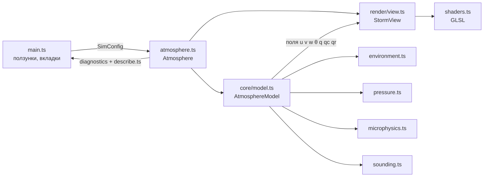
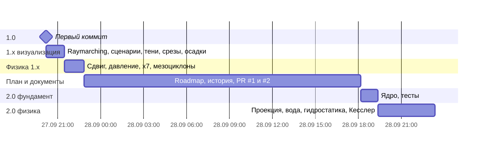

# StormLab (MeteoLAB) — полная история проекта, коммит за коммитом

> Репозиторий: `Bandananor/MeteoLAB` · ветка `main` · 33 коммита
> Период: **27.09.2026 20:11 → 28.09.2026 23:21 (MSK)**, около 27 часов календарного времени
> Состояние на момент написания: HEAD = `e5d07cc`, `npm test` → **6 файлов, 29 тестов, все проходят** (прогон 28.09.2026, ~61 с)

Документ состоит из четырёх больших частей:

1. **Что такое StormLab и как он работает сейчас** — модель, численные методы, микрофизика,
   диагностика, отрисовка и интерфейс. Это «точка прибытия», с которой удобно сравнивать всё остальное.
2. **Хронология** — все 33 коммита, сгруппированные в эпохи, с подробным разбором каждого:
   что поменялось, зачем, как это работает в коде, что было до и что стало после.
3. **Сравнения** — сквозные таблицы «было → стало» по каждой подсистеме, метрики кода и тестов,
   эволюция плана развития.
4. **Приложения** — статистика git, глоссарий, как самому проверить любую цифру из документа.

---

## Оглавление

- [Часть I. Как работает StormLab](#часть-i-как-работает-stormlab)
  - [1. Что это за программа](#1-что-это-за-программа)
  - [2. Архитектура кода](#2-архитектура-кода)
  - [3. Сетка и переменные](#3-сетка-и-переменные)
  - [4. Базовое состояние (зондирование)](#4-базовое-состояние-зондирование)
  - [5. Один шаг модели](#5-один-шаг-модели)
  - [6. Перенос и фиксатор массы](#6-перенос-и-фиксатор-массы)
  - [7. Проекция давления](#7-проекция-давления)
  - [8. Микрофизика](#8-микрофизика)
  - [9. Плавучесть, Кориолис, поверхность, параметризации](#9-плавучесть-кориолис-поверхность-параметризации)
  - [10. Диагностика: частица, UH, мезоциклон, режим](#10-диагностика-частица-uh-мезоциклон-режим)
  - [11. Отрисовка](#11-отрисовка)
  - [12. Интерфейс и сценарии](#12-интерфейс-и-сценарии)
  - [13. Тесты](#13-тесты)
- [Часть II. Хронология](#часть-ii-хронология)
  - [Сводная таблица коммитов](#сводная-таблица-коммитов)
  - [Эпоха 1. Версия 1.0 — первый рабочий симулятор](#эпоха-1-версия-10--первый-рабочий-симулятор)
  - [Эпоха 2. Версия 1.x — визуализация и удобство](#эпоха-2-версия-1x--визуализация-и-удобство)
  - [Эпоха 3. Первые исправления физики и мезоциклоны](#эпоха-3-первые-исправления-физики-и-мезоциклоны)
  - [Эпоха 4. План 2.0, документация, пулл-реквесты](#эпоха-4-план-20-документация-пулл-реквесты)
  - [Эпоха 5. Фундамент 2.0 — ядро и тесты](#эпоха-5-фундамент-20--ядро-и-тесты)
  - [Эпоха 6. Исправление физики по тестам](#эпоха-6-исправление-физики-по-тестам)
- [Часть III. Сравнения](#часть-iii-сравнения)
- [Часть IV. Приложения](#часть-iv-приложения)

---

# Часть I. Как работает StormLab

## 1. Что это за программа

StormLab — **идеализированная облакоразрешающая модель глубокой конвекции**, которая считается
прямо в браузере в реальном времени и показывает результат в 3D. Пользователь задаёт
«зондирование» — вертикальные профили температуры, влажности и ветра, — тип поверхности и
время суток. Дальше модель шаг за шагом (Δt = 1 с) интегрирует уравнения движения,
термодинамики и тёплой (без льда) микрофизики в коробке 48 × 36 × 15 км на сетке около 1 км.

В коробке рождаются термики, из них — кучевые облака, при достаточной неустойчивости —
грозы с дождём, холодным куполом (cold pool) и фронтом порывов, а при повороте ветра с высотой —
вращающиеся восходящие потоки (мезоциклоны) и суперячейки.

Параллельно модель считает то, что синоптик смотрит на аэрологической диаграмме: CAPE, CIN,
уровни LCL/LFC/EL, годограф и сдвиг ветра, и классифицирует режим конвекции.

Стек: **TypeScript + Vite + Three.js** (WebGL 2), тесты — **vitest** в Node. Никакого
серверного кода и внешних численных библиотек: решатель давления, микрофизика и всё остальное
написаны в проекте с нуля.

## 2. Архитектура кода

Состояние на HEAD (`e5d07cc`), 25 файлов `.ts` в `src/`, ~1960 строк:

```
src/
├── main.ts              интерфейс: ползунки, сценарии, вкладки, аэрологическая диаграмма, годограф
├── atmosphere.ts        связка модели и сцены — единственное, с чем говорит интерфейс
├── describe.ts          человеческое описание режима грозы (тексты)
├── style.css
├── core/                РАСЧЁТНОЕ ЯДРО — без DOM и Three.js, работает в Node
│   ├── config.ts        SimConfig (все ползунки) и свойства поверхностей
│   ├── constants.ts     g, c_p, L_v, R_d, R_v, κ, ε, Ω, Δt
│   ├── grid.ts          размеры сетки, шаги, таблицы периодических соседей
│   ├── environment.ts   базовое состояние: T(z), RH(z), ветер(z), гидростатическое p(z), ρ(z)
│   ├── model.ts         AtmosphereModel: прогностические поля и шаг модели
│   ├── pressure.ts      PressureSolver: точная согласованная проекция (ДПФ + прогонка)
│   ├── microphysics.ts  q_s, насыщающая коррекция, схема Кесслера, скорость падения
│   ├── sounding.ts      подъём частицы: CAPE/CIN/LCL/LFC/EL, ветер, уровень 0 °C
│   ├── solar.ts         инсоляция и направление на солнце
│   ├── fields.ts        диагностические поля для вкладок (w, Δθ, RH, ζ, UH, cold pool)
│   ├── math.ts          clamp, lerp, mod, lerpAngle, генератор mulberry32
│   ├── index.ts         публичный API ядра
│   ├── fixtures.ts      конфигурации и помощники для тестов
│   └── *.test.ts        6 файлов тестов
└── render/              ОТРИСОВКА
    ├── view.ts          StormView: сцена, свет, солнце, частицы, текстуры, срезы
    ├── shaders.ts       GLSL: raymarching облаков, тени, срезы, объём полей, осадки
    └── fields.ts        палитры и подписи полей
tests/reference/metpy_parcel.py   генератор эталонов CAPE/CIN через MetPy 1.7.1
```

Поток данных:



Ключевая идея, появившаяся в коммите `9279b97`: **ядро ничего не знает о браузере**. Его можно
создать в Node, прогнать 3600 шагов и проверить числа — на этом держатся все тесты.

```ts
import { AtmosphereModel, createGrid } from './src/core'
const model = new AtmosphereModel(config, createGrid({ nx: 40, ny: 32, nz: 24, width: 48_000, depth: 36_000, height: 15_000 }))
for (let s = 0; s < 3600; s++) { model.step(1); model.time += 1 }
console.log(model.rotation.uh, model.diagnostics().updraft, model.precipitation)
```

## 3. Сетка и переменные

| Параметр | Значение |
|---|---|
| Область | 48 × 36 × 15 км, **периодическая** по x и y |
| Узлов | 40 × 32 × 24 = 30 720 |
| Шаги | Δx = 1200 м, Δy = 1125 м, Δz = 15000/23 ≈ 652 м (равномерно) |
| Шаг по времени | Δt = 1 с |
| Вертикальные границы | земля и верх — непроницаемые стенки (w = 0) |
| Губка Рэлея | выше max(z_тропопаузы + 1,6 км, 13 км), до 6 %/с |

Все переменные хранятся **в узлах** сетки (сетка типа A, «несдвинутая») как `Float32Array`
длиной `nx·ny·nz`, индекс `i = x + nx·(y + ny·z)`:

| Поле | Смысл | Единицы |
|---|---|---|
| `u, v, w` | компоненты ветра | м/с |
| `theta` | потенциальная температура θ | K |
| `q` | массовая доля водяного пара q_v | кг/кг |
| `cloud` | облачная вода q_c | кг/кг |
| `rain` | дождевая вода q_r | кг/кг |
| `cold` | индикатор холодного купола (параметризация) | K |
| `pressure` | давление проекции, в центрах **двойственных** ячеек, `Float64Array` | м²/с (×Δt) |
| `precipitation` | сумма дождя, выпавшего на землю, по столбцам | мм |
| `uhColumn` | спиральность восходящего потока 2–5 км по столбцам | м²/с² |
| `fallSpeed` | скорость падения дождя в каждом узле | м/с |

Сетка создаётся функцией `createGrid(options)` и заранее строит таблицы периодических соседей
`xp, xm, yp, ym` — это одна из оптимизаций коммита `3dba857`, вынесенная в `grid.ts` при
разделении ядра.

## 4. Базовое состояние (зондирование)

Класс `Environment` (`src/core/environment.ts`) превращает ползунки в горизонтально однородный
фон, к которому модель стартует и относительно которого считает отклонения.

- **Температура** T(z) — кусочно-линейная: градиенты `lapseLow` (0–3 км), `lapseMid` (3–8 км),
  `lapseUpper` (8 км – тропопауза), выше тропопаузы — рост на `stratoWarming` K/км.
- **Относительная влажность** — кусочно-линейная по узлам 0; 1,5; 5 км; тропопауза.
  Понимается как отношение массовых долей r = RH·r_s (соглашение ВМО).
- **Ветер** — скорость и направление в узлах 0, 3, 6, 10 км. Скорость интерполируется линейно,
  **направление — по кратчайшей дуге** (`lerpAngle`, коммит `aee92f9`).
- **Давление** интегрируется гидростатически с шагом 10 м (коммит `6ec16d4`):

  $$\frac{d\ln p}{dz} = -\frac{g}{R_d T_v},\qquad T_v = T\,(1 + 0{,}61\,q),\qquad p_0 = 1013{,}25\ \text{гПа}$$

- **Плотность** ρ₀(z) = p / (R_d · θ · Π · (1 + 0,61 q)), где Π = (p/10⁵)^κ — функция Экснера.
  Используется в схеме Кесслера и в учёте осадков (коммит `0a59826`).
- **Насыщение**: q_s = ε·e_s/(p − e_s), e_s = 611,2·exp(17,67·t/(t + 243,5)) Па (формула Болтона),
  ограничено 0…0,045.

Все профили заранее табулируются по уровням модели (`env.p`, `env.exner`, `env.theta`, `env.q`,
`env.u`, `env.v`, `env.rho`) — ещё одна оптимизация из `3dba857`.

Начальное поле: фон + шум θ амплитудой ±0,009 K + два тёплых влажных «пузыря» в точках
(0,38 W; 0,45 D) и (0,61 W; 0,57 D) с силой `bubble` и 0,72·`bubble`:
θ += 3,2·a, q += 0,003·a, w += 1,1·a, где a = bubble·exp(−(r/4,2 км)² − (z/1,8 км)²).
Двойной клик по земле добавляет такой же пузырь в выбранной точке.

## 5. Один шаг модели

Метод `AtmosphereModel.step(dt)` (`src/core/model.ts`). Порядок операций в текущей версии:

```mermaid
flowchart TD
  A[1. Скорость падения дождя V_t в каждом узле — Кесслер] --> B[2. Выпадение дождя через землю → precipitation, мм]
  B --> C[3. Перенос дождя с учётом V_t + фиксатор массы]
  C --> D[4. Общая таблица точек отправления — одна на все поля]
  D --> E[5. Перенос u, v, w, θ, q, q_c, cold; фиксатор для q и q_c]
  E --> F[6. Цикл по узлам: физика]
  F --> F1[Кесслер: автоконверсия, аккреция, испарение дождя]
  F1 --> F2[Насыщающая коррекция]
  F2 --> F3[Плавучесть → w]
  F3 --> F4[Кориолис на отклонение от фонового ветра]
  F4 --> F5[Потоки тепла и влаги от поверхности]
  F5 --> F6[Параметризации cold pool и микропорыва]
  F6 --> F7[Горизонтальное перемешивание θ и q]
  F7 --> F8[Губка у верхней границы]
  F8 --> G[7. Трение у земли ×0,94, w=0 на земле и верху]
  G --> H[8. Проекция давления — точная]
  H --> I[9. Ограничители |u|,|v| ≤ 85, |w| ≤ 60 м/с]
  I --> J[10. UH по столбцам, счётчик мезоциклона]
```

`advance(realDt)` копит реальное время × ускорение (`speed`) и делает не больше 12 шагов
за кадр — чтобы тяжёлый кадр не запускал «лавину» догоняющих шагов.

Схема расщепления — типичная для учебных облачных моделей: сначала перенос (адвекция) всех
полей по скорости начала шага, затем «источники» (физика) по месту, в конце — проекция,
которая делает поле скорости бездивергентным (несжимаемое приближение ∇·u = 0).

## 6. Перенос и фиксатор массы

**Полулагранжев перенос.** Для каждого узла ищется точка, из которой частица воздуха пришла
за Δt: x_d = x − u·Δt/Δx (и так же по y, z). Значение поля в этой точке берётся трилинейной
интерполяцией по 8 окружающим узлам. Такая схема безусловно устойчива (можно брать большой
шаг), но **диффузна** и **не консервативна** (сумма поля не сохраняется).

Оптимизация `3dba857`: точки отправления (8 индексов углов + 3 веса на узел) считаются
**один раз за шаг** в `computeBacktrace` и используются для всех полей — это и быстрее, и
правильнее (все поля переносятся одной и той же скоростью начала шага; раньше u переносилось,
а потом уже изменённым u переносились v, w и т. д.).

Дождь переносится отдельно (`advectFalling`), потому что у него к вертикальной скорости
добавляется скорость падения: z_d = z − (w − V_t)·Δt/Δz.

У верхней границы (коммит `cad251d`) исправлена тонкость: раньше z ограничивался `nz − 1,001`,
и верхний узел каждый шаг подмешивал 0,1 % значения уровня под собой (≈ −0,17 K/ч у верха).
Теперь нижний индекс ограничен `nz − 2`, и верхний узел может взять вес 1.

**Фиксатор массы** (`commit(a, decay, conserve, loss)`, коммит `d316745`). После переноса
q, q_c и q_r считается объёмная сумма до и после (узлы на земле и верху весят ½ слоя).
Лишнее (или недостающее) количество раскладывается **пропорционально |новое − старое|** — то
есть туда, где перенос реально что-то двигал, а не по всему спокойному воздуху:

```ts
const excess = after - (before - loss)          // loss — дождь, ушедший в землю
const c = excess / moved                        // moved = Σ w_z·|s − a|
s[i] = Math.max(0, s[i] - c * Math.abs(s[i] - a[i]))
```

Это временная мера до консервативной схемы переноса в форме потоков (уровень 2 плана).

## 7. Проекция давления

Это самая сложная и самая важная часть ядра, переписанная в коммите `cad251d`.

**Зачем нужна.** В несжимаемой модели скорость должна удовлетворять ∇·u = 0. После переноса
и сил это не так. Проекция находит давление p из уравнения Пуассона ∇²p = ∇·u*/Δt и
вычитает градиент: u = u* − Δt·∇p.

**Что было не так (до `cad251d`).** Дивергенция и градиент считались центральными
разностями «через узел» (шаблон шириной 2Δx), а уравнение решалось с компактным
7-точечным лапласианом. Композиция D·G ≠ L, поэтому:

- даже полностью сошедшаяся проекция убирала **ровно половину** горизонтально однородного w
  (10 мм/с → 5,00 мм/с) — и число итераций на это не влияло;
- оставалось ложное опускание ~1,6 мм/с по всей толще и дрейф фона (θ на 0,28 K за 3 ч);
- центральные разности «не видят» **шахматную** моду скорости; на ней полулагранжев перенос
  **создавал воду** — +27…50 % в час в грозе — и лишнюю теплоту конденсации.

**Как сейчас (`src/core/pressure.ts`).**

1. Скорости остаются в узлах, а давление живёт в центрах **двойственных ячеек** — кубиков,
   углами которых служат 8 соседних узлов. Таких ячеек `nx·ny·(nz−1)`.
2. Дивергенция ячейки D — поток через её грани, посчитанный по 8 углам (усреднение по 4 узлам
   каждой грани). Именно эту дивергенцию «видит» трилинейный перенос.
3. Градиент G = −M⁻¹Dᵀ — **точное сопряжение** D (узлы на стенках с весом ½). Тогда D·G —
   согласованный лапласиан, и u − Δt·G·p бездивергентно **точно**, а не приближённо.
4. Уравнение (D·G)p = rhs решается **точно**, а не итерациями: по x и y область периодична,
   поэтому оператор диагонализуется двумерным дискретным преобразованием Фурье.
   Для каждой пары волновых чисел (m, n) остаётся трёхдиагональная система по z:

   $$(-\alpha_{mn} Z_A + \beta_{mn} Z_\delta)\,\hat p = \hat r,\quad
   \alpha = 4\Big(\tfrac{\sin^2(\pi m/n_x)\cos^2(\pi n/n_y)}{\Delta x^2} + \tfrac{\cos^2(\pi m/n_x)\sin^2(\pi n/n_y)}{\Delta y^2}\Big),\quad
   \beta = \tfrac{\cos^2(\pi m/n_x)\cos^2(\pi n/n_y)}{\Delta z^2}$$

   где Z_A = tridiag(¼, ½, ¼) (¾ на строках стенок), Z_δ = tridiag(1, −2, 1) (−1 на стенках).
   Решается методом прогонки (Томаса).
5. Тонкости: вход вещественный, поэтому считается только половина спектра по x (0…nx/2);
   однородная мода (α = β = 0) и «шахматная» (π, π) мода — нулевые моды оператора, для них
   p = 0 (а cos²(π/2) в плавающей точке равен 3,7·10⁻³³, а не 0 — пришлось явно «прибивать»
   такие значения, иначе решение взрывалось); однородная по горизонтали мода закрепляется
   в нижней ячейке.

Итог, измеренный тестами: остаточная дивергенция после проекции **~10⁻¹¹ с⁻¹** (было ~10⁻³),
дрейф фона за 3 ч **0,004 K** (было 0,28 K), шаг модели **17 мс** (было 23 мс), из них проекция ~7 мс.

## 8. Микрофизика

`src/core/microphysics.ts`, коммиты `7e27fc4` и `0a59826`. Только жидкая вода: пар, облако, дождь.

**Схема Кесслера** (как в Klemp & Wilhelmson 1978 и в модели CM1; плотности — в г/см³):

| Процесс | Формула |
|---|---|
| Автоконверсия (облако → дождь) | 0,001 с⁻¹ · max(0, q_c − 1 г/кг) |
| Аккреция (дождь собирает облако) | 2,2 · q_c · q_r^0,875 с⁻¹ |
| Испарение дождя | (1 − q/q_s)·C·(ρq_r)^0,525 / (ρ·(5,4·10⁵ + 2,55·10⁶/(p·q_s))), C = 1,6 + 124,9·(ρq_r)^0,2046; не дальше насыщения |
| Скорость падения | V_t = 36,34·(0,001·ρ·q_r)^0,1364·√(ρ₀/ρ) м/с |

Пример: 1 г/кг дождя у земли падает со скоростью 5,7 м/с, 5 г/кг — 7,05 м/с; наверху, где
воздух вдвое реже, — в 0,5^0,1364·√2 ≈ 1,29 раза быстрее.

Испарение дождя охлаждает воздух: Δθ = −L_v/(c_p·Π)·Δq·`coldPoolStrength` (множитель —
известная «подгонка», пункт плана уровня 1), и это охлаждение же копится в индикаторе `cold`.

**Насыщающая коррекция** — после Кесслера, в каждом узле, каждый шаг:

$$\Delta q = \frac{q - q_s(T)}{1 + \dfrac{L_v^2\,q_s}{c_p R_v T^2}}$$

Два шага Ньютона; избыток пара конденсируется в облако с выделением тепла, облако в
ненасыщенном воздухе испаряется до насыщения или до исчезновения. После шага
|q − q_s| < 10⁻⁴·q_s. Тест проверяет, что сохраняется вода q + q_c и
жидководная потенциальная температура θ_l ≈ θ − L_v/(c_p Π)·q_c.

## 9. Плавучесть, Кориолис, поверхность, параметризации

- **Плавучесть** (коммит `531481f`):

  $$B = g\left[\frac{\theta_v - \theta_{v,env}}{\theta_{v,env}} - q_c - q_r\right],\qquad \theta_v = \theta\,(1 + 0{,}61\,q_v)$$

  Облако и дождь утяжеляют воздух ровно своей массой. w += B·Δt.
- **Кориолис** на f-плоскости, f = 2Ω·sin φ, действует только на **отклонение** от фонового
  ветра (фон считается геострофическим). Отклонение же слегка затухает (×0,9999 за шаг).
- **Поверхность.** Инсоляция S = S_max·max(0, sin(π(h − 6)/12)) (день равноденствия).
  Поглощается S·(1 − альбедо); явное тепло = поглощённое·sensible/inertia, влага =
  поглощённое·(1 − sensible)·evap·влажность почвы. Всё это вкладывается в два нижних уровня с
  пятнистым множителем (случайное блуждание, ±32 %), который даёт термикам «места рождения».
  Свойства поверхностей:

  | Тип | Альбедо | Доля явного тепла | Испарение | «Инерция» |
  |---|---|---|---|---|
  | Трава | 0,20 | 0,42 | 0,75 | 0,65 |
  | Сухая почва | 0,30 | 0,72 | 0,15 | 0,45 |
  | Вода | 0,08 | 0,18 | 1,25 | 1,80 |
  | Город | 0,16 | 0,78 | 0,08 | 0,80 |

  Баланс энергии поверхности пока не выполняется (увлажнение примерно в 9 раз меньше, чем
  соответствовало бы скрытому теплу) — это пункт плана.
- **Параметризации холодного купола и микропорыва** (живут с первого коммита):
  - на краю купола (по горизонтальному градиенту `cold`) воздух ниже min(3,2 км, LFC) получает
    дополнительный подъём — имитация фронта порывов;
  - в ядре купола (cold > 1 K) ниже 1,3 км — дополнительное опускание;
  - если у земли w < −5 м/с и есть дождь, считается «удар» микропорыва, и ветер у земли
    получает радиальный отток.
  Это не динамика, а подсказки модели; план — убрать их, когда появятся растянутая сетка и
  приземный слой.
- **Перемешивание**: горизонтальное сглаживание θ и q к среднему 4 соседей со скоростью
  `turbulence`·0,15 %/с. Импульс и вертикаль не перемешиваются.
- **Трение у земли**: u, v нижнего уровня × 0,94 за шаг (временно).
- **Губка**: выше губочного уровня w, u, v, θ плавно тянутся к фону.

## 10. Диагностика: частица, UH, мезоциклон, режим

**Подъём частицы** (`computeSounding`, коммит `6ec16d4`). Частица от поверхности (в приложении —
с перегревом +0,5 K и вовлечением; в тестах — «чистая») поднимается **по давлению среды**
с шагом 25 м:

- до насыщения — сухая адиабата через сохранение θ: T₁ = T₀·(p₁/p₀)^κ;
- после — псевдовлажная адиабата

  $$\frac{dT}{dp} = \frac{1}{p}\cdot\frac{R_d T + L_v r_s}{c_p + \dfrac{L_v^2 r_s\,\varepsilon}{R_d T^2}}$$

  методом средней точки (второй порядок).

Плавучесть частицы считается по виртуальной температуре; отсюда LCL (первое насыщение),
LFC (первая положительная плавучесть выше LCL), EL (снова отрицательная, выше LFC + 200 м),
CAPE и CIN. Сверка с MetPy 1.7.1 на трёх профилях: CAPE ±1,1 %, CIN ±2 Дж/кг, LCL и EL ±30 м.

**Спиральность восходящего потока** UH = ∫ w·ζ dz по слою 2–5 км для каждого столбца,
ζ = ∂v/∂x − ∂u/∂y. Пороги откалиброваны под диффузную сетку ~1 км:

| Константа | Значение | Смысл |
|---|---|---|
| `UH_ROTATING` | 100 м²/с² | «в потоке появилось вращение» |
| `UH_MESOCYCLONE` | 150 м²/с² | порог мезоциклона |
| `MESO_PERSISTENCE` | 600 с | сколько должен продержаться максимум UH ≥ 150 |

(В оперативных моделях с шагом 3 км обычно ~75 м²/с².) Минимум UH (антициклоническое
вращение ≥ 150) трактуется как признак расщепления на правую и левую ячейки.

**Ядра и режим.** Столбец «активен», если на уровнях 3–10 (≈ 2–6,5 км) есть w > 2 м/с с облаком;
связные по горизонтали активные столбцы считаются заливкой — это число ядер. Дальше
`describe.ts` выбирает режим: термики пограничного слоя → развивающийся cumulus → одиночная
ячейка → наклонённая организованная ячейка (сдвиг 0–6 км > 18 м/с) → две ячейки →
мультиячейка → преобладание оттока (купол > 7 K при слабом подъёме) → **суперячейка с мезоциклоном**.
К режиму прилагается текст «что происходит»: насыщение на LCL, ускорение выше LFC,
растекание у EL (наковальня), подтекание купола, микропорыв, наклон и растяжение вихрей.

## 11. Отрисовка

`src/render/view.ts` + `src/render/shaders.ts` (исторически `volumeShaders.ts`).

- **Облака — объёмный raymarching** (коммит `2383093`). Поля q_c и q_r упаковываются в 3D-текстуру
  RG8 размером 40×32×24; куб области рисуется изнанкой, и для каждого пикселя фрагментный
  шейдер делает 96 шагов вдоль луча: закон Бугера–Ламберта для поглощения, 5 шагов к солнцу
  для самозатенения, фазовая функция Хеньи–Гринстейна (смесь g = 0,55 и −0,2), «powder»-эффект
  (тёмные края плотных облаков), подсеточная эрозия фрактальным шумом fbm (сетка 1 км слишком
  груба для кучевой текстуры), дождь — серо-голубой вуалью, туман по глубине.
- **Тени облаков на земле** (`014a06f`): в материал земли вставлен код, который 24 шагами идёт
  от точки земли к солнцу по той же текстуре и ослабляет **только прямой** солнечный свет —
  в тени остаётся свет неба.
- **Солнце** (`5bf46fa`): направление по местному времени и широте (равноденствие), восход в 6:00,
  закат в 18:00, тёплый цвет у горизонта; интенсивность прямого и рассеянного света меняется.
- **Поля в 3D** (`5bf46fa`): два подвижных среза — горизонтальный (высота) и вертикальный
  (север ↔ юг) — с палитрой, изолиниями и нулевой линией; плюс «объём сильных отклонений»,
  который рисует эмиссией только значимые области и обрывается на непрозрачных срезах.
  Поля: вертикальная скорость, отклонение температуры, влажность, вертикальная завихренность
  (со знаком), UH, cold pool.
- **Частицы потоков** (10 000 трассеров, цвет по w) и **частицы осадков** (8000, `4d91291`):
  рождаются из поля q_r, выше уровня 0 °C падают снегом (2 м/с), в слое 600 м под ним
  «тают» в капли, исчезают там, где дождь испарился. Льда в модели нет — это только визуализация.
  С `0a59826` скорость падения капель берётся из поля Кесслера. С `9279b97` частицы двигаются
  раз в кадр на прошедшее модельное время (а не каждый шаг модели).
- **Маркер мезоциклона** (`3dba857`): оранжевое кольцо на высоте 3,5 км над столбцом с
  максимальным UH, когда мезоциклон подтверждён.
- Плоскости LCL, LFC, EL и уровень 0 °C — полупрозрачные сетки на соответствующих высотах.

## 12. Интерфейс и сценарии

Левая панель — ползунки `SimConfig`: температурный профиль (6), влажность (4 + вовлечение),
ветер (4 скорости + 4 направления), динамика (широта, турбулентность), поверхность и радиация
(тип, время, S_max, влажность почвы), микрофизика и cold pool (3 множителя), расчёт
(ускорение, seed, сила пузыря). Изменение профиля перезапускает опыт; ускорение, турбулентность
и множители микрофизики действуют «на лету».

Над сценой — вкладки полей, «Потоки →», «Снег и дождь». Правая панель — режим конвекции,
аэрологическая диаграмма (T, T_d, частица, закраска CAPE/CIN, 0 °C, подписи уровней),
годограф 0–10 км со сдвигом 0–6 км, числа: CAPE, CIN, w_max, w_min, вершина облака и термиков,
водность, cold pool, микропорыв, интенсивность дождя, UH.

Сценарии (кнопки) — наборы переопределений поверх значений по умолчанию:

| Сценарий | Что меняет | Появился |
|---|---|---|
| Летний день | ничего (умолчания) | `084b38b` |
| Мощная гроза | T 34 °C, влажно внизу, градиент 9 K/км | `084b38b` |
| Сухой воздух | RH 3–7 км и выше — 10 % | `084b38b` |
| Сдвиг ветра | 18/40/50 м/с на 3/6/10 км | `084b38b` |
| Микропорыв | сухой подоблачный слой, испарение ×2, cold pool ×2,5 | `084b38b` |
| **Суперячейка** | поворот ветра 140° → 255°, пузырь ×1,8, CAPE ≈ 3,6 кДж/кг | `3dba857` |
| Жаркий город | город, сухая почва, S_max 1000 | `084b38b` |

## 13. Тесты

`npm test` → vitest в Node, 6 файлов, 29 тестов:

| Файл | Что проверяет |
|---|---|
| `model.test.ts` | модель работает без браузера, размеры сетки — параметры, детерминизм по seed, шаги сетки |
| `invariants.test.ts` | фон без триггера 3 ч: θ ± 0,05 K, ветер ± 0,05 м/с, q ± 0,2 % от приземного; проекция убирает однородный w; после шага в грозе дивергенция < 10⁻⁷; баланс воды в грозе за 1 ч < 0,1 % |
| `pressure.test.ts` | решатель на 6 сетках (1×1×4 … 40×32×24), включая чётные с шахматной модой: дивергенция падает в 10⁶ раз, давление конечно |
| `sounding.test.ts` | CAPE/CIN/LCL/LFC/EL против MetPy 1.7.1 на трёх профилях; поведение параметров частицы; гидростатика (276,49 гПа на 10 км) |
| `environment.test.ts` | направление ветра через север по кратчайшей дуге |
| `microphysics.test.ts` | скорость падения, автоконверсия и аккреция, испарение не дальше насыщения, насыщающая коррекция |

Принцип, введённый в `450bd1f`: **известные ошибки помечаются `it.fails`**. Такой тест обязан
падать; когда исправление заработает, vitest сам сообщит, что «ожидаемо падающий» тест прошёл, —
и пометку снимают. История этих пометок — готовый журнал исправлений (см. Часть III).

---

# Часть II. Хронология

## Сводная таблица коммитов

Время — московское (+03:00); коммиты автора `Claude` записаны в UTC и здесь пересчитаны.
«Файлов/строк» — число `.ts` файлов в `src/` и строк в них **после** коммита; «Тесты» — число
тестов по факту запуска (с учётом цикла в `pressure.test.ts`) / из них `it.fails`.

| # | Хэш | Дата, время | Автор | Заголовок | Файлов / строк | Тесты |
|---|---|---|---|---|---|---|
| 1 | `df45d6a` | 27.09 20:11 | Bandananor | Initial commit: StormLab 3D atmospheric convection simulator | 2 / 262 | — |
| 2 | `2383093` | 27.09 20:24 | Bandananor | Render clouds with volumetric raymarching | 3 / 402 | — |
| 3 | `6df9b61` | 27.09 20:24 | Bandananor | Rewrite README for a general audience | 3 / 402 | — |
| 4 | `084b38b` | 27.09 20:33 | Bandananor | Add one-click weather scenario presets | 3 / 430 | — |
| 5 | `415e078` | 27.09 20:33 | Bandananor | Add MIT license and document scenario presets | 3 / 430 | — |
| 6 | `014a06f` | 27.09 20:54 | Bandananor | Cast cloud shadows onto the ground | 3 / 457 | — |
| 7 | `5bf46fa` | 27.09 21:11 | Bandananor | Show fields as 3D slices and volumes; move the sun with time of day | 3 / 634 | — |
| 8 | `0f3f5ef` | 27.09 21:11 | Bandananor | Describe field slices and moving sun in README | 3 / 634 | — |
| 9 | `4d91291` | 27.09 21:29 | Bandananor | Add hodograph, richer sounding and snow-to-rain precipitation view | 3 / 748 | — |
| 10 | `3dba857` | 27.09 22:50 | Bandananor | Fix wind-shear erosion and pressure BC, speed up core 7x, detect mesocyclones | 3 / 845 | — |
| 11 | `bb3a0e0` | 27.09 22:58 | Bandananor | Add StormLab 2.0 roadmap | 3 / 845 | — |
| 12 | `770f1da` | 28.09 10:48 | Claude | Add detailed project and commit history documentation | 3 / 845 | — |
| 13 | `aa73572` | 28.09 14:34 | Bnor | Delete ROADMAP.md | 3 / 845 | — |
| 14 | `0931057` | 28.09 14:46 | Bnor | Add StormLab 2.0 roadmap | 3 / 845 | — |
| 15 | `38ba6b5` | 28.09 14:47 | Bnor | Merge pull request #1 | 3 / 845 | — |
| 16 | `32796ed` | 28.09 15:23 | Claude | Merge origin/main into claude/commit-history-documentation | 3 / 845 | — |
| 17 | `f5faa64` | 28.09 15:24 | Claude | Rename roadmap to roadmap.markdown and correct it against the code | 3 / 845 | — |
| 18 | `98d4f13` | 28.09 15:26 | Bnor | Merge pull request #2 | 3 / 845 | — |
| 19 | `576947f` | 28.09 18:10 | Bandananor | Refine roadmap after reviewing it against the code | 3 / 845 | — |
| 20 | `9279b97` | 28.09 18:27 | Bandananor | Split the physics core from the Three.js view | 17 / 1404 | 4 / 0 |
| 21 | `5fb62b7` | 28.09 18:32 | Bandananor | Roadmap: layer display modes, 3D mesocyclone view, radar MDA and TVS | 17 / 1404 | 4 / 0 |
| 22 | `450bd1f` | 28.09 19:23 | Bandananor | Add invariant tests; reprioritise the roadmap around the projection bug | 20 / 1543 | 13 / 8 |
| 23 | `cad251d` | 28.09 19:54 | Bandananor | Replace the pressure projection with an exact, consistent solver | 22 / 1719 | 20 / 5 |
| 24 | `d316745` | 28.09 20:05 | Bandananor | Conserve water in transport and account for rain reaching the ground | 22 / 1757 | 20 / 4 |
| 25 | `2abab8e` | 28.09 20:06 | Bandananor | Rewrite README for meteorologists and programmers | 22 / 1757 | 20 / 4 |
| 26 | `8aa90ef` | 28.09 20:12 | Bandananor | Remove the hidden decay sinks of vapour, cloud, rain and w | 22 / 1758 | 20 / 3 |
| 27 | `0017f5e` | 28.09 20:26 | Bandananor | Roadmap: realistic scenario rework, interactive tools, tornado track | 22 / 1758 | 20 / 3 |
| 28 | `6ec16d4` | 28.09 20:36 | Bandananor | Hydrostatic base state and a parcel that follows pressure | 22 / 1797 | 21 / 0 |
| 29 | `aee92f9` | 28.09 22:12 | Bandananor | Interpolate wind direction along the shorter arc | 23 / 1821 | 23 / 0 |
| 30 | `531481f` | 28.09 22:39 | Bandananor | Buoyancy without fudge factors | 23 / 1822 | 23 / 0 |
| 31 | `7e27fc4` | 28.09 22:53 | Bandananor | Exact saturation adjustment | 25 / 1888 | 26 / 0 |
| 32 | `0a59826` | 28.09 23:18 | Bandananor | Kessler warm-rain microphysics | 25 / 1957 | 29 / 0 |
| 33 | `e5d07cc` | 28.09 23:21 | Bandananor | Stop tracking PROJECT_HISTORY.md (personal notes) | 25 / 1957 | 29 / 0 |

> Тест-кейсы посчитаны так, как их видит vitest: цикл в `pressure.test.ts` даёт 6 кейсов,
> цикл сверки с MetPy — 3. В `450bd1f` «ожидаемо падающими» были 5 инвариантов и 3 сверки
> с MetPy (8 из 13). Подробно по каждому тесту — в таблице «Жизнь тестов it.fails» в Части III.

Как устроены эпохи во времени:



---

## Эпоха 1. Версия 1.0 — первый рабочий симулятор

### Коммит 1 · `df45d6a` · Initial commit: StormLab 3D atmospheric convection simulator

**27.09.2026 20:11 · Bandananor · 11 файлов, +1407 строк**

С чего всё началось. Сообщение коммита: «Custom TypeScript/Three.js CFD sandbox modeling
cloud-scale convection: semi-Lagrangian advection, incompressible pressure projection, Coriolis,
bulk microphysics, cold pool/gust front dynamics, and parcel-theory diagnostics (CAPE/CIN/LCL/LFC/EL).
Removed the unused 2D prototype and default Vite template scaffolding.»

То есть до публикации существовал ещё 2D-прототип, который в репозиторий не попал.

**Состав:**

| Файл | Строк | Содержание |
|---|---|---|
| `src/simulator3d.ts` | 111 | **вся** модель и вся отрисовка в одном классе `Atmosphere` |
| `src/main.ts` | 151 | разметка интерфейса, ползунки, диаграмма, цикл кадров |
| `README.md` | 52 | краткое описание |
| `index.html`, `style.css`, `package.json`, `tsconfig.json`, иконки | | обвязка Vite |

Зависимости: `three@0.185`, `typescript@6.0`, `vite@8.1`. Скрипты: `dev`, `build`, `preview` — тестов нет.

**Как был устроен код.** 111 строк очень плотного TypeScript (многие строки — по 500–2000 символов).
Константы сетки были жёстко зашиты: `NX=40, NY=32, NZ=24, W=48 000, D=36 000, H=15 000`.
Класс `Atmosphere` одновременно держал `THREE.WebGLRenderer`, камеру, сцену, все поля модели и
физику. Индекс узла считался функцией `idx(x,y,z)` с `mod` и `clamp` на каждый доступ.

**Физика версии 1.0** (всё это позже будет заменено — смотрите столбец «кем исправлено»):

| Элемент | Как было в 1.0 | Кем исправлено |
|---|---|---|
| Давление фона | p = 101 325·exp(−z/8000) (без связи с температурой) | `6ec16d4` |
| Перенос | полулагранжев, трилинейный; каждое поле своим `advect`, **последовательно** (v переносилось уже перенесённым u) | `3dba857` |
| Затухания при переносе | u, v ×0,9999; w ×0,9995; q ×0,999999; q_c ×0,99995; q_r ×0,9995; cold ×0,9992 — **каждый шаг** | `3dba857` (u, v), `8aa90ef` (остальные) |
| Дождь | падает с постоянной скоростью 7 м/с, в землю — не учитывается | `d316745`, `0a59826` |
| Конденсация | 32 % избытка пара в секунду | `7e27fc4` |
| Испарение облака | 0,00006·`entrainment`·(1 − RH) — от ползунка «вовлечение» | `7e27fc4` |
| Автоконверсия | 3,5 %/с выше 0,9 г/кг × `precipEfficiency` | `0a59826` |
| Испарение дождя | (q_s − q)·0,018·`evaporation` за секунду | `0a59826` |
| Плавучесть | (θ − θ_env)/max(250, θ_env) + 0,61(q − q_env) − 1,8·q_c − 2,5·q_r | `531481f` |
| Проекция | 16 итераций Гаусса–Зейделя (без ускорения), давление сбрасывается в 0 каждый шаг, p = 0 **на земле**, центральные разности | `3dba857`, затем `cad251d` |
| Трение у земли | после проекции: u, v ×0,94, w = 0 | `cad251d` (перенесено до проекции) |
| Кориолис | на отклонение от фонового ветра | — (сохранён) |
| Параметризации cold pool / микропорыва | подъём на краю купола, опускание в ядре, радиальный отток | — (в плане на удаление) |
| Направление ветра | линейная интерполяция градусов | `aee92f9` |
| Частица | шаг 100 м по высоте, влажноадиабатический градиент по формуле для T_част = T_среды | `6ec16d4` |

**Отрисовка 1.0:** облака — **облако точек** (до 14 000 спрайтов с мягкой текстурой, 1–3 копии
на узел в зависимости от водности, с детерминированным дрожанием), поля — прореженные точки
(каждый второй узел) с цветом, векторы ветра — отрезки, трассеры — 10 000 частиц.
Вкладки: «Облака», «Температура», «Относительная влажность», «Завихренность» (модуль
трёхмерного вихря), «Cold pool».

**Интерфейс 1.0** был сразу на русском («ЧИСЛЕННАЯ ЛАБОРАТОРИЯ АТМОСФЕРЫ / 1.0 3D»),
с 29 ползунками и выбором типа поверхности, двойным кликом для термика, диагностикой режима и аэрологической
диаграммой (только T среды и частица).

**Почему это важно.** Многие решения первой версии (сетка, Δt, список ползунков, набор
параметризаций, классификация режимов, тексты `describe`) дожили до сегодняшнего дня почти
без изменений. Всё, что делалось дальше, — это либо украшение картинки (эпоха 2), либо
последовательная замена «подгонок» на физику (эпохи 3 и 6).

---

## Эпоха 2. Версия 1.x — визуализация и удобство

Вечер 27 сентября: за 78 минут — 8 коммитов, превративших «точки» в объёмные облака с тенями,
а сам симулятор — в удобную игрушку со сценариями.

### Коммит 2 · `2383093` · Render clouds with volumetric raymarching

**27.09 20:24 · +149 / −9 · новый файл `src/volumeShaders.ts` (133 строки)**

Облако точек заменено **объёмным рендерингом**:

1. Каждый кадр, пока открыта вкладка «Облака», поля пишутся в 3D-текстуру `Data3DTexture` 40×32×24 формата RG8:
   R = clamp((q_c − 0,03 г/кг)/1,4 г/кг), G = clamp(q_r/2,5 г/кг). Фильтрация линейная,
   по x и y — повтор (область периодична), по z — обрезка.
2. Куб области рисуется `BackSide`-гранями, `ShaderMaterial` с шейдерами `volumeVertex`/`volumeFragment`.
3. Во фрагментном шейдере: пересечение луча с коробкой, 96 шагов с дрожанием начала (убирает
   «полосы»), на каждом шаге — плотность облака с fbm-эрозией (`cloudDensity`), 5 шагов к солнцу
   для оптической толщи (самозатенение), фаза Хеньи–Гринстейна, «powder», цвет неба снизу вверх,
   смешение облака и дождя, ранний выход при прозрачности < 2 %, туман по средней глубине.
4. Функция `toTex` аккуратно переводит мировые координаты в текстурные: узлы лежат на краях
   коробки, а центр текселя — в (k + 0,5)/N.

Добавлена легенда «осадки». **Сравнение:** до — сотни полупрозрачных спрайтов, видны отдельные
точки, нет освещения; после — сплошной объём с освещённой солнцем «шапкой» и тёмным основанием.

### Коммит 3 · `6df9b61` · Rewrite README for a general audience

**27.09 20:24 · README +101 / −43**

README переписан для неспециалиста: что делает песочница, как запустить, какие опыты
попробовать, что означают CAPE, CIN, LCL и прочие числа; технические детали — в конце.
(Через сутки, в `2abab8e`, README будет переписан снова — уже для метеорологов и программистов.)

### Коммит 4 · `084b38b` · Add one-click weather scenario presets

**27.09 20:33 · `main.ts` +42 / −13**

Появились **сценарии**. Значения по умолчанию вынесены в объект `defaults`, а каждый сценарий —
`{ name, hint, values: Partial<SimConfig> }` с небольшим набором переопределений.
Нажатие: `Object.assign(config, defaults, { speed: config.speed }, preset.values)` —
ускорение времени сохраняется, ползунки синхронизируются, опыт перезапускается, кнопка
подсвечивается; ручное изменение профиля снимает подсветку.

Шесть сценариев: «Летний день», «Мощная гроза», «Сухой воздух», «Сдвиг ветра», «Микропорыв»,
«Жаркий город» (подробности — в таблице раздела 12).

### Коммит 5 · `415e078` · Add MIT license and document scenario presets

**27.09 20:33 · `LICENSE` +21, README +35 / −14**

Лицензия MIT и описание сценариев в README. Коммит сделан в ту же минуту, что и предыдущий.

### Коммит 6 · `014a06f` · Cast cloud shadows onto the ground

**27.09 20:54 · +45 / −18**

**Тени облаков на земле.** Общий GLSL-код (`volumeCommon`: юниформы, `toTex`, `fields`) вынесен,
чтобы использоваться двумя материалами. В стандартный `MeshStandardMaterial` земли через
`onBeforeCompile` вставлена функция `cloudShadow(p)`: 24 шага от точки земли к солнцу до верха
области, оптическая толща `od += q_c + 0,3·q_r`, множитель `exp(−od·ds·extinction·0,8)`
применяется **только к прямому солнечному** свету. Поэтому тень не «чёрная» — в ней остаётся
свет неба (полусферический источник).

### Коммит 7 · `5bf46fa` · Show fields as 3D slices and volumes; move the sun with time of day

**27.09 21:11 · +228 / −50 · крупнейший коммит визуализации**

1. **Поля — срезами и объёмом** вместо прореженных точек:
   - горизонтальный срез на заданной высоте и вертикальный разрез «север ↔ юг», оба — с палитрой
     (256-цветная `DataTexture`), изолиниями и выделенной нулевой линией;
   - «объём сильных отклонений» — второй raymarching, который светится только там, где
     |значение| выше порога, и **обрывается на срезах** (срезы непрозрачны);
   - описания полей `FIELDS` (заголовок, единицы, диапазон, дивергентная или нет палитра, порог);
   - панель с цветовой шкалой и ползунками срезов.
2. **Поля стали физически осмысленными:** «Температура» — отклонение от окружения (±4 K),
   «Завихренность» — **вертикальная со знаком** (раньше — модуль вектора), влажность — RH %,
   cold pool — охлаждение (K). Новая вкладка — **вертикальная скорость** (±15 м/с).
3. **Солнце движется**: направление по местному времени и широте (равноденствие, согласовано
   с формулой инсоляции), тёплый свет низкого солнца, в панели — высота солнца.
4. **Исправлены три ошибки:**
   - сцена была **зеркальной**: север отображался на +Z; теперь север — на −Z, правая тройка;
   - после перезапуска **переставали работать живые ползунки** — модель получала копию
     `{...config}`, а интерфейс менял оригинал;
   - перезапуск сбрасывал выбранную вкладку — теперь настройки вида хранятся в объекте `view`
     и переприменяются к новому экземпляру.

**Сравнение:** до — «облако цветных точек», где нельзя понять, что на какой высоте; после —
метеорологический разрез, как в научных статьях.

### Коммит 8 · `0f3f5ef` · Describe field slices and moving sun in README

**27.09 21:11 · README +6 / −3.** Документация к предыдущему коммиту.

### Коммит 9 · `4d91291` · Add hodograph, richer sounding and snow-to-rain precipitation view

**27.09 21:29 · +143 / −20**

1. **Аэрологическая диаграмма**: закраска CAPE (частица теплее среды) и CIN, **точка росы среды**,
   линия 0 °C, подписи LCL/LFC/EL. Тип `ParcelPoint` получил поле `dew`, появился тип `Sounding`
   с полями `wind` и `freezing`.
2. **Годограф** 0–10 км (точки ветра каждые 250 м) с вектором сдвига 0–6 км.
3. **Снег и дождь**: переключатель; до 8000 частиц рождаются из поля q_r с вероятностью,
   пропорциональной водности; выше уровня 0 °C падают снегом (2 м/с), в слое 600 м «тают»
   (шейдер плавно меняет вид снежинки на каплю по атрибуту `aMelt`), капли падают 7 м/с,
   исчезают при касании земли, через 40 минут или там, где дождь испарился.
   Комментарий в коде честно говорит: «Visual only: the model has no ice».
4. Добавлена сетка-плоскость уровня 0 °C.

---

## Эпоха 3. Первые исправления физики и мезоциклоны

### Коммит 10 · `3dba857` · Fix wind-shear erosion and pressure BC, speed up core 7x, detect mesocyclones

**27.09 22:50 · +134 / −32 · первый «физический» коммит**

Это переломный коммит: впервые работа идёт не над картинкой, а над корректностью чисел.
Изменения проверялись **безголовым стендом** (headless harness) — прообразом будущих тестов.

**Исправления физики:**

1. **Затухание сдвига ветра.** Перенос умножал **весь** ветер на 0,9999 каждый шаг.
   За час: 0,9999³⁶⁰⁰ ≈ 0,70 — фоновый сдвиг таял примерно на 30 % в час, а ведь сдвиг —
   главное условие суперячейки. Теперь затухает только **отклонение** от фона:
   ```ts
   const du = (u[i] - ue) * .9999, dv = (v[i] - ve) * .9999
   u[i] = ue + du + f * dv * dt; v[i] = ve + dv - f * du * dt
   ```
2. **Граничное условие давления у земли.** Было p = 0 на земле (давление «прибито»), стало
   ∂p/∂z = 0 (копия уровня 1 в уровень 0 на каждой итерации) — согласуется с w = 0.
   Итерации стали **SOR** (ω = 1,7) с **тёплым стартом** — давление не обнуляется между шагами,
   потому что Δt постоянен и поле меняется мало.
3. **Все поля переносятся одной скоростью начала шага** (общая таблица точек отправления).

**Ускорение в 7 раз** (шаг ~160 мс → ~23 мс):
- профили фона табулированы по уровням (`computeEnv`) вместо вызова `thetaEnv(alt)`, `qEnv(alt)`,
  `pressureAt(alt)`, `windUV(alt)` в каждом узле на каждом шаге;
- прямые индексы соседей через таблицы `XP, XM, YP, YM` вместо `idx()` с `mod`/`clamp`;
- одна общая таблица точек отправления (8 индексов + 3 веса на узел) на все поля;
- трассеры обновляются, только когда показаны.

Автор отмечает, что до изменения обратной трассировки результат был **бит в бит** тем же —
то есть ускорение проверялось на отсутствие побочных изменений.

**Детекция мезоциклона:**
- UH = Σ w·ζ·Δz по уровням 2–5 км для каждого столбца; максимум, его координаты, минимум;
- пороги 100 / 150 м²/с² и правило устойчивости 10 минут;
- кольцо-маркер над столбцом максимума UH;
- вкладка поля **UH** (±300 м²/с²);
- тексты про наклон и растяжение вихрей, про расщепление ячеек;
- новый ползунок **силы начального пузыря** (`bubble`) и откалиброванный сценарий **«Суперячейка»**
  (изогнутый годограф 140° → 255°, умеренная CAPE, пузырь ×1,8).

**Сравнение с 1.0:** сдвиг ветра теперь держится; шаг в 7 раз быстрее; модель умеет сказать
«это суперячейка» и показать, где мезоциклон. Но проекция всё ещё приближённая —
и через сутки выяснится, что она убирает лишь половину ошибки.

---

## Эпоха 4. План 2.0, документация, пулл-реквесты

### Коммит 11 · `bb3a0e0` · Add StormLab 2.0 roadmap

**27.09 22:58 · `ROADMAP.md` +45**

Первый план развития. Четыре **этапа**:

1. Фундамент: разделить `simulator3d.ts` на ядро и отрисовку; Web Worker; автотесты физики.
2. Физика: лёд (снег, крупа, град), сдвинутая сетка MAC и точнее перенос, приземный слой вместо ×0,94,
   домен, движущийся с грозой.
3. Инструменты синоптика: радар в dBZ, редактор годографа, SRH/Банкерс/SCP/STP, графики по времени.
4. Высокое разрешение: WebGPU, вложенная сетка для торнадных вихрей.

Раздел «Что уже есть (1.x)» фиксирует: шаг ~23 мс, старые сценарии «сознательно оставлены с
экстремальной CAPE (5–9 тыс. Дж/кг)».

### Коммит 12 · `770f1da` · Add detailed project and commit history documentation

**28.09 07:48 UTC (10:48 MSK) · Claude · `PROJECT_HISTORY.md` +989**

Первая версия этого самого документа: как работает StormLab (сетка, шаг, проекция, теория
частицы, диагностика, отрисовка), разбор каждого из 11 тогдашних коммитов и сравнение
каждого с первым и последним состоянием. Сделан в отдельной ветке
`claude/commit-history-documentation-6vjtrz`.

### Коммиты 13–15 · `aa73572`, `0931057`, `38ba6b5` · Замена плана через GitHub

**28.09 14:34–14:47 · Bnor (веб-интерфейс GitHub)**

- `aa73572` — удалён `ROADMAP.md`;
- `0931057` — добавлен `ROADMAP_NEW.md` (153 строки, сделан в сессии Claude): вместо четырёх
  этапов — **четыре уровня важности** 🔴 «супер важно — физика неверна или нечем проверять» /
  🟠 «важно — ограничивает реализм» / 🟡 «полезно — инструменты» / 🟢 «удобство», и раздел «Порядок»;
- `38ba6b5` — слияние **пулл-реквеста #1** (ветка `claude/github-commit-push-0caxak`).

Смена принципа планирования: не «по темам», а «по тому, насколько сильно это портит результат».

### Коммиты 16–18 · `32796ed`, `f5faa64`, `98d4f13` · Сверка плана с кодом, PR #2

**28.09 15:23–15:26**

- `32796ed` (Claude) — в ветку документации влит свежий `main` (с новым планом);
- `f5faa64` (Claude) — `ROADMAP_NEW.md` переименован в **`roadmap.markdown`** (224 строки)
  и **проверен по коду**. Исправления:
  - пункт про испарение дождя был неверен: θ охлаждается; реальные проблемы — множитель
    `coldPoolStrength` у скрытого охлаждения и **двойной учёт** cold pool;
  - добавлены пропущенные пункты уровня 1: дождь не выпадает на землю в учёте, **несогласованный
    шаблон проекции**, ошибка направления ветра на 0°/360°, несогласованные потоки от поверхности;
  - исправлены числа (ошибка гидростатики, SRH) и объём задачи «движущийся домен»;
  - тесты разделены на **инварианты** и **калибровочные** (которые перекалибровывают после каждого
    исправления); Straka и Bryan–Fritsch — в уровень 2;
  - Web Worker поднят в уровень 2, пересмотрена оценка времени;
  - `PROJECT_HISTORY.md` дополнен описанием замены плана (+38 строк);
- `98d4f13` (Bnor) — слияние **пулл-реквеста #2**.

### Коммит 19 · `576947f` · Refine roadmap after reviewing it against the code

**28.09 18:10 · roadmap +44 / −25**

Все численные утверждения плана **независимо перепроверены**. Уточнения:
- тест баланса воды — с допуском на дрейф (полулагранжев перенос не консервативен);
- тест фона требует **устойчивого** профиля и удаления стока `q·0,999999`;
- эталоны MetPy хранить в тестах;
- убрать ползунки-подгонки микрофизики;
- никакой промежуточной «широкой» проекции — сразу правильная;
- неупругое приближение и верхнее граничное условие — одним изменением решателя;
- домен, следующий за грозой, — в уровень 2;
- ограничить очередь шагов;
- у каждого сценария — свой пузырь, старые сценарии — решать по одному.

---

## Эпоха 5. Фундамент 2.0 — ядро и тесты

### Коммит 20 · `9279b97` · Split the physics core from the Three.js view

**28.09 18:27 · 22 файла, +1160 / −308 · первый пункт уровня 1 закрыт**

Монолит `simulator3d.ts` (298 строк к этому моменту) **удалён** и разложен:

| Было в `simulator3d.ts` | Стало |
|---|---|
| `SimConfig`, свойства поверхностей | `src/core/config.ts` |
| константы | `src/core/constants.ts` |
| `NX, NY, NZ, W, D, H, DX…`, `XP…YM` | `src/core/grid.ts` → `createGrid(options)` — **параметры** |
| профили фона, `qsat`, ветер, точка росы | `src/core/environment.ts` → класс `Environment` |
| поля, перенос, шаг, проекция, UH, ядра, диагностика | `src/core/model.ts` → класс `AtmosphereModel` (232 строки) |
| частица | `src/core/sounding.ts` → `computeSounding` |
| инсоляция, направление солнца | `src/core/solar.ts` |
| значения полей для вкладок | `src/core/fields.ts` |
| `clamp, lerp, mod, mulberry32` | `src/core/math.ts` |
| сцена, материалы, частицы, текстуры | `src/render/view.ts` → класс `StormView` (273 строки) |
| палитры и описания полей | `src/render/fields.ts` |
| шейдеры | `src/volumeShaders.ts` → `src/render/shaders.ts` (переименование без изменений) |
| тексты о режиме | `src/describe.ts` |
| внешний API для интерфейса | `src/atmosphere.ts` — класс `Atmosphere` (35 строк) |

Код переформатирован из «одной строки на метод» в обычный многострочный стиль.

**Проверка:** физика **совпадает бит в бит** со старым `simulator3d.ts` на 2400 шагах для
«Летнего дня» и «Суперячейки». Единственное осознанное изменение поведения — трассеры и
частицы осадков двигаются раз в кадр на прошедшее модельное время (раньше — на каждом шаге
модели, из-за чего отрисовка была внутри физики).

**Появился vitest** (`npm test`) и первые 4 теста `model.test.ts`: модель работает в Node,
размер сетки — параметр (20×16×12), детерминизм по seed, шаги сетки 1200/1125/652 м.

**Сравнение:** раньше проверить физику можно было только глазами в браузере; теперь — `npm test`.

### Коммит 21 · `5fb62b7` · Roadmap: layer display modes, 3D mesocyclone view, radar MDA and TVS

**28.09 18:32 · roadmap +24.** В уровень 3 добавлены: режимы отображения слоёв («срезы + объём» /
«только срезы» / «только объём»), полная 3D-структура мезоциклона вместо кольца, на радаре —
алгоритм обнаружения мезоциклона (MDA) и сигнатура торнадного вихря (TVS).

### Коммит 22 · `450bd1f` · Add invariant tests; reprioritise the roadmap around the projection bug

**28.09 19:23 · +326 / −42 · «момент истины»**

Написаны тесты, которые формулируют **законы**, а не подогнанные ожидания, — и почти все
**упали**. Каждое падение оформлено `it.fails` с комментарием, какой пункт плана его починит.

| Тест | Замер на тот момент |
|---|---|
| фон без триггера 3 ч: θ(z) ± 0,05 K | **дрейф 0,28 K** |
| фон: ветер ± 0,05 м/с | **0,052 м/с** |
| фон: q(z) ± 0,2 % | до 15 % у верха (сток ×0,999999 + ложное опускание) |
| проекция убирает однородный w (даже 2000 итераций) | **убирает ровно половину: 10 → 5,00 мм/с** |
| баланс воды в грозе за 1 ч ± 1 % | **+27 %** |
| CAPE/CIN/LCL/LFC/EL против MetPy на 3 профилях | CAPE на 7–15 % выше, CIN «закрытого» профиля 128 против 59, EL до 0,75 км выше |

Добавлены:
- `src/core/fixtures.ts` — конфигурации `SUMMER_DAY`, `SUPERCELL`, `CAPPED` (умеренная CAPE с
  задерживающим слоем), `QUIET` (устойчивый, сухой, без солнца и пузыря), функции `run`,
  `levelMean`, `totalWater`;
- `computeSounding(..., { excess, entrain })` — возможность считать «чистую» частицу для сверки;
- `tests/reference/metpy_parcel.py` — генератор эталонов MetPy 1.7.1.

**Главный вывод**, перестроивший план: причина большинства бед — **несогласованная проекция**.
Она оставляет шахматную скорость, на которой перенос создаёт воду, и ложное опускание, которое
сносит фон. Поэтому «согласованная проекция» стала **первым** исправлением физики, а все
калибровки отложены до неё («иначе калибровка ляжет на неверную динамику»).

Попутно план уточнил: дождь в землю **уходит** (капля без испарения за 20 минут вытекает через
нижнюю границу на 99,7 %), но не учитывается; найдена утечка при переносе у верхней границы;
добавлены большая область, настоящая физика молний, структура суперячейки из динамики
(FFD, RFD, окклюзия) и скрытые случайные сиды.

---

## Эпоха 6. Исправление физики по тестам

Вечер 28 сентября: за четыре часа — девять коммитов, каждый из которых переводит один или
несколько `it.fails` в зелёные тесты.

### Коммит 23 · `cad251d` · Replace the pressure projection with an exact, consistent solver

**28.09 19:54 · +263 / −73 · новый `src/core/pressure.ts` (152 строки) и `pressure.test.ts`**

Самое важное исправление физики за всю историю. Подробно принцип описан в
[разделе 7](#7-проекция-давления); здесь — что именно поменялось.

**Было** (`model.ts`, метод `project(dt, iters)` из `3dba857`):

```ts
// дивергенция — центральные разности «через узел»
div[i] = (u[XP[x]+row] - u[XM[x]+row])/(2*DX) + (v[x+yp] - v[x+ym])/(2*DY) + (w[i+LAYER] - w[i-LAYER])/(2*DZ)
// 16 итераций SOR с КОМПАКТНЫМ 7-точечным лапласианом
p[i] += omega * (((p[XP]+p[XM])*ix + (p[YP]+p[YM])*iy + (p[i+L]+p[i-L])*iz - div[i]/dt)/den - p[i])
// градиент — снова центральные разности
u[i] -= dt*(p[XP[x]+row] - p[XM[x]+row])/(2*DX) ...
```

Центральная разность дивергенции от центральной разности градиента даёт «широкий» лапласиан
(шаг 2Δx), а решается «узкий». Из-за этого несоответствия проекция не может обнулить
дивергенцию в принципе, а шахматная мода скорости для центральных разностей невидима вовсе.

**Стало:**

```ts
private project(dt: number) {
  this.solver.divergence(u, v, w, dt, this.divergence) // поток через грани двойственной ячейки по 8 углам
  this.solver.solve(this.divergence, this.pressure)    // точно: ДПФ по x, y + прогонка по z
  this.solver.correct(this.pressure, u, v, w, dt)      // градиент = точное сопряжение дивергенции
  // ограничители скоростей
}
```

Дополнительно в этом же коммите:
- **утечка у верхней границы** при переносе (`nz − 1,001` → индекс ≤ `nz − 2`);
- **трение у земли и w = 0 на стенках — до проекции**, а не после: иначе скорость, которой
  переносятся поля на следующем шаге, снова имела бы дивергенцию;
- давление стало `Float64Array` размером `nx·ny·(nz−1)` (центры ячеек, а не узлы);
- `vitest.config.ts` с таймаутом 120 с (физические тесты гоняют модель часами модельного времени);
- новый тест: «после шага в грозе не остаётся дивергенции» (< 10⁻⁷ с⁻¹ при float32-скоростях).

**Цифры до → после:**

| Величина | До | После |
|---|---|---|
| Дивергенция после проекции | ~10⁻³ с⁻¹ | ~10⁻¹¹ с⁻¹ |
| Однородный w 10 мм/с после проекции | 5,00 мм/с | < 0,1 мм/с (тест), фактически 0 |
| Дрейф θ фона за 3 ч | 0,28 K | 0,004 K |
| Дрейф ветра фона за 3 ч | 0,052 м/с | 0,005 м/с |
| Создание воды в грозе | +27 %/ч | +7,5 %/ч (остаток — сам перенос) |
| Шаг модели | 23 мс | 17 мс (точный решатель быстрее 16 итераций SOR) |

**Побочный эффект, честно записанный в сообщении:** «Storms are weaker and more honest;
the Supercell preset no longer develops» — грозы стали слабее, «Суперячейка» перестала
развиваться. Часть её силы давала ошибка проекции. Перекалибровку решено делать после
блока микрофизики.

Из плана заодно вычеркнут «точный решатель» уровня 2 — он сделан здесь же. «Широкий»
согласованный шаблон пробовали, и он хуже (+34 % воды за 30 мин), поэтому выбрана
двойственная сетка.

Тесты: 3 из 5 падавших инвариантов **прошли** (θ, ветер, однородный w), `it.fails` сняты.

### Коммит 24 · `d316745` · Conserve water in transport and account for rain reaching the ground

**28.09 20:05 · +79 / −38**

После согласованной проекции оставалось +7,5 % воды в час, и замер по процессам показал:
весь прирост — от трилинейного полулагранжева переноса (он не консервативен даже на
бездивергентной скорости).

1. **Фиксатор массы** — метод `commit(a, decay, conserve, loss)` (см. [раздел 6](#6-перенос-и-фиксатор-массы)).
   Применяется к q, q_c, q_r. Веса уровней: земля и верх — ½ (они владеют половиной слоя).
2. **Учёт осадков.** Новый метод `rainFallout(dt)`: поток через землю ρ·q_r·V_t·Δt по каждому
   столбцу копится в `precipitation` (мм = кг/м²) и вычитается из баланса дождя (`loss`),
   чтобы фиксатор не «вернул» выпавший дождь в воздух.
3. Перенос разделён на «перенести в scratch» и «записать с фиксатором» (`advectBacktrace` +
   `commit`), затухания пока сохранены (передаются в `commit` параметром `decay`).
4. `fixtures.totalWater` теперь считает объёмный интеграл с весами уровней **плюс** выпавшее на землю.

Итог: тест баланса воды **проходит** — −0,98 %/ч, и это уже не перенос, а «скрытые стоки»
(множители затухания), которые убираются следующим физическим коммитом.

### Коммит 25 · `2abab8e` · Rewrite README for meteorologists and programmers

**28.09 20:06 · README +188 / −114**

README переписан второй раз, теперь как описание научной модели:
постановка (область, сетка, базовое состояние, динамика, численные методы, микрофизика,
поверхность, диагностика), **честная таблица известных ограничений** с замерами и ссылками
на пункты плана, раздел о тестах, API ядра для программистов, поведение сценариев на текущей
физике и журнал изменений 2.0. С этого момента каждый физический коммит обновляет README
(журнал и ограничения) вместе с кодом.

### Коммит 26 · `8aa90ef` · Remove the hidden decay sinks of vapour, cloud, rain and w

**28.09 20:12 · +22 / −17**

Удалены множители за шаг, которые уничтожали воду и импульс без всякого физического процесса:

| Множитель | Что делал | Характерное время |
|---|---|---|
| `q · 0,999999` | уничтожал пар | 1 % за 3 ч (ломал тест фона) |
| `cloud · 0,99995` | уничтожал облачную воду, не возвращая её в пар | ~5,5 ч |
| `rain · 0,9995` | уничтожал дождь | ~33 мин |
| `w · 0,9995` | гасил вертикальную скорость | ~33 мин — сравнимо с жизнью ячейки |

Оставлено только затухание индикатора `cold · 0,9992` — оно часть параметризации cold pool и
уйдёт вместе с ней.

Итог: баланс воды в грозе — **0,000 %/ч**, допуск теста ужесточён с 1 % до **0,1 %**.
Тест влажности фона переформулирован: отклонение меряется **от приземного значения q**, а не
относительно уровня (у тропопаузы q в ~1000 раз меньше, и относительная ошибка там мерила шум), —
и проходит. Последний инвариант `it.fails` снят; остались только три сверки с MetPy.

### Коммит 27 · `0017f5e` · Roadmap: realistic scenario rework, interactive tools, tornado track

**28.09 20:26 · roadmap +66 / −11**

Три больших новых направления плана:
- **Уровень 2 — переработка сценариев** в реалистичные среды с CIN и умеренной CAPE:
  классическая суперячейка Weisman–Klemp (1982), HSLC (сильный сдвиг, малая CAPE),
  HCLS «пульсирующие» грозы, «заряженное ружьё» (EML-крышка, CIN 100–200 Дж/кг),
  линия шквалов / деречо (баланс RKW), сухой микропорыв («перевёрнутое V»), тропическая конвекция.
  Сейчас у старых сценариев CAPE 5–9 кДж/кг и CIN ≈ 0 — «так в природе почти не бывает».
- **Уровень 3 — инструменты воздействия в реальном времени**: нагреть/охладить,
  увлажнить/иссушить кистью, положить холодный купол, провести линию сходимости, добавить вихрь,
  перекрасить поверхность, поставить «зонд» в любую точку; всё с учётом в балансах.
- **Отдельное направление — торнадические вихри**: вложенная сетка 100–250 м вокруг нижнего
  мезоциклона, физика у земли (завихренность от трения, бароклинная на краю RFD), диагностика
  смерча (EF по ветру, дефицит давления), воронка конденсации, проверка по литературе
  (Orf et al. 2017, Markowski & Richardson).

### Коммит 28 · `6ec16d4` · Hydrostatic base state and a parcel that follows pressure

**28.09 20:36 · +110 / −46**

Три ошибки, найденные одним тестом (сверкой с MetPy):

1. **Давление фона.** Было p₀·exp(−z/8 км) — не связано с температурой профиля: −2 % на 3–5 км,
   **+20 % на 15 км**. Стало гидростатическое интегрирование ln p с шагом 10 м по T_v самого
   профиля (`Environment.integrateHydrostatic`). Проверка: 276,49 гПа на 10 км, как у MetPy
   (старая формула давала 290,3).
2. **Подъём частицы.** Было — по высоте с шагом 100 м и влажноадиабатическим градиентом
   Γ_m = g(1 + L r_s/(R_d T))/(c_p + L² r_s ε/(R_d T²)), выведенным в предположении T_част = T_среды.
   В сильной неустойчивости частица на 10–15 K теплее среды, и ошибка накапливалась:
   **+6,5 K на 12 км**. Стало — по давлению среды: сухая адиабата через θ, влажная —
   dT/dp методом средней точки, шаг 25 м (мелкий шаг нужен, чтобы не «сдвигать» LCL).
   Вовлечение по-прежнему задаётся «на 100 м» и пересчитывается на фактический шаг.
3. **Эталон MetPy был неверен.** `cape_cin` в MetPy ≥ 1.4 сам делает виртуальную поправку, а
   скрипту передавались уже виртуальные температуры — поправка применялась **дважды**
   (CIN 59 вместо 124 Дж/кг). И скрипт считал влажность через давление пара (e = RH·e_s), а
   модель — через массовые доли (r = RH·r_s). Эталон пересчитан в соглашениях модели.

| Профиль | Эталон до (CAPE / CIN / LCL / LFC / EL) | Эталон после |
|---|---|---|
| summer | 6367,6 / 0 / 0,729 / 1,164 / 12,350 | 6144,9 / 0 / 0,704 / 1,145 / 12,392 |
| supercell | 4072,6 / 0 / 0,723 / 1,134 / 11,776 | 3860,9 / −10,8 / 0,699 / 1,115 / 11,814 |
| capped | 1898,4 / −58,6 / 1,028 / 2,691 / 11,180 | 1817,4 / −113,5 / 0,998 / 2,554 / 11,218 |

Допуски теста ужесточены: CAPE 5 % → **2 %**, CIN 10 → **5 Дж/кг**, LCL 150 → **50 м**,
EL 300 → **100 м**; LFC проверяется только там, где задерживающий слой реален (при слабом CIN
частица между LCL и LFC почти нейтральна, ~10⁻⁴ м/с², и высота LFC плохо обусловлена).
Фактическое совпадение: CAPE ±1,1 %, CIN ±2 Дж/кг, LCL/EL ±30 м.
CAPE приложения на «Летнем дне» — **4,9 кДж/кг** (было 5,35).

**Все 21 тест проходят** — впервые с момента появления тестов-инвариантов ни одного `it.fails`.

### Коммит 29 · `aee92f9` · Interpolate wind direction along the shorter arc

**28.09 22:12 · +36 / −9**

`lerp(350°, 10°, ½) = 180°` — между узлами профиля ветер дул **с противоположной стороны**.
Новая функция:

```ts
export const lerpAngle = (a: number, b: number, t: number) => mod(a + (mod(b - a + 180, 360) - 180) * clamp(t), 360)
```

Направление поворачивает по кратчайшей дуге, скорость по-прежнему линейна. Профили, не
пересекающие север (все встроенные сценарии), не изменились **до бита**. Новый тест
`environment.test.ts`: 350° → 10° на полпути даёт 0°, 300° → 60° тоже 0°, и ветер
действительно дует с севера (v < 0, u ≈ 0).

### Коммит 30 · `531481f` · Buoyancy without fudge factors

**28.09 22:39 · +12 / −7**

| | Формула |
|---|---|
| Было | B/g = (θ − θ_env)/max(250, θ_env) + 0,61·(q − q_env) − **1,8**·q_c − **2,5**·q_r |
| Стало | B/g = (θ_v − θ_v,env)/θ_v,env − q_c − q_r |

Конденсат утяжеляет воздух **ровно своей массой** (коэффициенты 1,8 и 2,5 были подгонкой —
видимо, чтобы сделать нисходящие потоки сильнее), а знаменатель — виртуальная потенциальная
температура окружения. Эффект: восходящие потоки в развитых грозах сильнее на 10–25 %,
UH выше на 20–80 %. «Суперячейка» по-прежнему не развивается.

### Коммит 31 · `7e27fc4` · Exact saturation adjustment

**28.09 22:53 · +82 / −10 · новый модуль `src/core/microphysics.ts` и его тесты**

| | Было | Стало |
|---|---|---|
| Конденсация | 32 % избытка пара за секунду | весь избыток за шаг с учётом нагрева: Δq = (q − q_s)/(1 + L²q_s/(c_p R_v T²)), 2 шага Ньютона |
| Испарение облака | 0,00006·`entrainment`·(1 − RH) — **от ползунка вовлечения частицы** | до насыщения или исчезновения облака, той же формулой |
| Равновесие после шага | нет (перенасыщение держалось секундами) | \|q − q_s\| < 10⁻⁴·q_s |

`qsatP` переехала из `Environment` в `microphysics.ts`, в `constants.ts` добавлена R_v = 461,5.
Тесты: перенасыщенная ячейка приходит к насыщению за шаг, конденсируется лишь часть избытка
(нагрев поднимает q_s), вода и θ_l сохраняются; облако испаряется в сухом воздухе; чистый
ненасыщенный воздух не трогается.

Влияние на грозы слабое (UH ±5 %): основной сток облака — автоконверсия 3,5 %/с, её чинит
следующий коммит.

### Коммит 32 · `0a59826` · Kessler warm-rain microphysics

**28.09 23:18 · +107 / −33**

Полная схема Кесслера (см. [раздел 8](#8-микрофизика)):

| Процесс | Было | Стало |
|---|---|---|
| Автоконверсия | 3,5 %/с выше 0,9 г/кг | **0,1 %/с** выше 1 г/кг (в 35 раз медленнее) |
| Аккреция | нет | 2,2·q_c·q_r^0,875 |
| Испарение дождя | (q_s − q)·0,018 за секунду (~в 20 раз сильнее) | Klemp–Wilhelmson с вентиляцией, не дальше насыщения |
| Скорость падения | 7 м/с всегда | 36,34·(0,001ρq_r)^0,1364·√(ρ₀/ρ), в каждом узле |
| Плотность | не было | `Environment.rho` |

Ползунки «Эффективность осадков» и «Испарение осадков» стали множителями скоростей Кесслера
(1 = чистый Кесслер). Выпадение на землю теперь считается с настоящей V_t.
Частицы осадков на экране тоже падают со скоростью из поля `fallSpeed`.
Константа `RAIN_FALL = 7` удалена.

Эффект: дождь начинается позже, **грозы живут дольше, холодные купола слабее**, сценарий
«Микропорыв» снова даёт порывы. Добавлено 3 теста (скорость падения, автоконверсия и
аккреция, испарение) — итого **29 тестов, все проходят**.

### Коммит 33 · `e5d07cc` · Stop tracking PROJECT_HISTORY.md (personal notes)

**28.09 23:21 · `.gitignore` +3, `PROJECT_HISTORY.md` −1017**

Документ истории (к этому моменту 1017 строк) убран из репозитория и добавлен в `.gitignore`
как личные заметки. Он описывал проект до эпохи 5 и устарел после разделения ядра.
Нынешний файл — его полностью переписанная версия, учитывающая все 33 коммита.

---

# Часть III. Сравнения

## Эволюция физики: первый коммит → сейчас

| Подсистема | 1.0 (`df45d6a`) | 1.x (`3dba857`) | Сейчас (`0a59826`) |
|---|---|---|---|
| Давление фона | p₀·exp(−z/8 км) | то же | гидростатика по T_v, шаг 10 м |
| Плотность фона | 1,18·exp(−z/9 км) в потоках от земли | то же | ρ₀(z) из p, θ, q (для Кесслера и осадков; в потоках от земли — пока старая формула) |
| Направление ветра | линейно по градусам | то же | кратчайшая дуга |
| Перенос | каждое поле отдельно, последовательно | общая таблица точек отправления | то же + фиксатор массы для q, q_c, q_r |
| Верхняя граница переноса | утечка 0,1 %/шаг | то же | исправлено |
| Затухания | u, v, w, q, q_c, q_r, cold | u, v — только отклонение; остальные те же | только cold (и отклонение u, v) |
| Проекция | 16 итераций Г–З, p = 0 на земле, давление с нуля | 16 итераций SOR ω = 1,7, ∂p/∂z = 0, тёплый старт | точная: ДПФ + прогонка, двойственная сетка, D·G согласован |
| Трение у земли | после проекции | после проекции | до проекции |
| Конденсация | 32 %/с избытка | то же | насыщающая коррекция (Ньютон) |
| Испарение облака | от ползунка вовлечения | то же | до насыщения |
| Автоконверсия | 3,5 %/с выше 0,9 г/кг | то же | Кесслер 0,1 %/с выше 1 г/кг |
| Аккреция | — | — | 2,2·q_c·q_r^0,875 |
| Испарение дождя | 0,018·(q_s − q)/с | то же | Klemp–Wilhelmson |
| Падение дождя | 7 м/с | 7 м/с | V_t(q_r, ρ) |
| Осадки на землю | не учитывались | не учитывались | сумма по столбцам, в балансе |
| Плавучесть | ×1,8 q_c, ×2,5 q_r, max(250, θ) | то же | θ_v, коэффициенты 1 |
| Частица | по высоте, 100 м, Γ_m при T_ч = T_ср | то же | по давлению, 25 м, dT/dp второго порядка |
| Мезоциклон | нет | UH 2–5 км, пороги, 10 мин | то же |
| Скорость шага | ~160 мс | ~23 мс | ~17 мс |

## Эволюция формул в одном месте

**Плавучесть**
```
1.0 … 531481f^ : B/g = (θ − θe)/max(250, θe) + 0.61 (q − qe) − 1.8 qc − 2.5 qr
531481f → …    : B/g = (θv − θve)/θve − qc − qr
```

**Конденсация**
```
1.0 … 7e27fc4^ : cond = min(q − qs, 0.32 (q − qs) dt)
7e27fc4 → …    : dq = (q − qs) / (1 + L² qs / (cp Rv T²)), ×2 (Ньютон), в обе стороны
```

**Дождь**
```
1.0 … 0a59826^ : auto = 0.035 max(0, qc − 0.0009) · eff;   Vt = 7 м/с;   evap = 0.018 (qs − q)
0a59826 → …    : auto = 0.001 max(0, qc − 0.001) + 2.2 qc qr^0.875;   Vt = 36.34 (0.001 ρ qr)^0.1364 √(ρ0/ρ)
                 evap = KW(1 − q/qs, ρ qr, p, qs), ≤ насыщения
```

**Давление фона**
```
1.0 … 6ec16d4^ : p(z) = 101325 · exp(−z / 8000)
6ec16d4 → …    : d ln p / dz = −g / (Rd Tv(z)),  Δz = 10 м
```

## Жизнь тестов `it.fails`

| Тест | Появился | Статус в `450bd1f` | Стал проходить | Кто починил |
|---|---|---|---|---|
| фон: θ(z) ± 0,05 K за 3 ч | `450bd1f` | ✗ 0,28 K | `cad251d` | согласованная проекция + верхняя граница |
| фон: ветер ± 0,05 м/с | `450bd1f` | ✗ 0,052 | `cad251d` | то же |
| фон: q(z) ± 0,2 % | `450bd1f` | ✗ до 15 % | `8aa90ef` | удаление стока q·0,999999 + новая мера |
| проекция убирает однородный w | `450bd1f` | ✗ ровно половина | `cad251d` | согласованная проекция |
| нет дивергенции после шага в грозе | `cad251d` | — | сразу | — |
| баланс воды в грозе | `450bd1f` (±1 %) | ✗ +27 %/ч | `d316745` (−0,98 %), ужесточён в `8aa90ef` (±0,1 %, факт 0,000 %) | проекция → фиксатор → удаление стоков |
| MetPy: summer | `450bd1f` | ✗ CAPE +7…15 % | `6ec16d4` | гидростатика, частица по давлению, исправленный эталон |
| MetPy: supercell | `450bd1f` | ✗ | `6ec16d4` | то же |
| MetPy: capped | `450bd1f` | ✗ CIN 128 против 59 | `6ec16d4` | то же |

## Эволюция баланса воды в грозе (1 ч, без солнца)

```
до cad251d   ████████████████████████████  +27 %/ч    несогласованная проекция + перенос
cad251d      ███████▌                      +7,5 %/ч   остаток — неконсервативный перенос
d316745      ▏                             −0,98 %/ч  фиксатор массы; остаток — скрытые стоки
8aa90ef                                     0,000 %/ч  стоки убраны
```

## Метрики кода по коммитам

| Коммит | `.ts` в `src/` | Строк | Тестов (кейсов) | `it.fails` | Шаг модели |
|---|---|---|---|---|---|
| `df45d6a` 1.0 | 2 | 262 | 0 | — | ~160 мс (оценка: 23 × 7) |
| `2383093` raymarching | 3 | 402 | 0 | — | |
| `5bf46fa` срезы | 3 | 634 | 0 | — | |
| `4d91291` осадки | 3 | 748 | 0 | — | |
| `3dba857` физика ×7 | 3 | 845 | 0 | — | ~23 мс |
| `9279b97` ядро | 17 | 1404 | 4 | 0 | ~23 мс |
| `450bd1f` инварианты | 20 | 1543 | 13 | 8 | |
| `cad251d` проекция | 22 | 1719 | 20 | 5 | ~17 мс |
| `d316745` фиксатор | 22 | 1757 | 20 | 4 | |
| `8aa90ef` стоки | 22 | 1758 | 20 | 3 | |
| `6ec16d4` гидростатика | 22 | 1797 | 21 | 0 | |
| `aee92f9` ветер | 23 | 1821 | 23 | 0 | |
| `7e27fc4` насыщение | 25 | 1888 | 26 | 0 | |
| `0a59826` Кесслер | 25 | 1957 | 29 | 0 | |

Код вырос в 7,5 раза, но не за счёт «фич»: около половины прироста после `9279b97` —
тесты, фикстуры и решатель давления.

## Эволюция отрисовки и интерфейса

| Возможность | Появилась | Как было до |
|---|---|---|
| Объёмные облака (raymarching) | `2383093` | облако из 14 000 точек |
| Сценарии одной кнопкой | `084b38b` | только ползунки |
| Тени облаков на земле | `014a06f` | не было |
| Движущееся солнце | `5bf46fa` | неподвижный источник света |
| Поля срезами + объём, изолинии, шкала | `5bf46fa` | прореженные цветные точки |
| Вкладка вертикальной скорости | `5bf46fa` | — |
| Знаковая вертикальная завихренность | `5bf46fa` | модуль 3D-вихря |
| Исправлено зеркалирование сцены | `5bf46fa` | север на +Z |
| Точка росы, закраска CAPE/CIN, подписи уровней | `4d91291` | только T и частица |
| Годограф | `4d91291` | — |
| Снег и дождь частицами | `4d91291` | — |
| Уровень 0 °C в сцене | `4d91291` | — |
| Вкладка UH, кольцо мезоциклона, текст про вращение | `3dba857` | — |
| Ползунок силы пузыря, сценарий «Суперячейка» | `3dba857` | — |
| Частицы раз в кадр | `9279b97` | каждый шаг модели |
| Капли падают со скоростью Кесслера | `0a59826` | 7 м/с |

## Эволюция документации и плана

| Документ | История |
|---|---|
| `README.md` | 52 строки (`df45d6a`) → для широкой публики (`6df9b61`) → сценарии, лицензия (`415e078`) → срезы, солнце (`0f3f5ef`) → годограф, осадки (`4d91291`) → мезоциклон (`3dba857`) → ядро и тесты (`9279b97`) → **для метеорологов и программистов** (`2abab8e`, 231 строка) → журнал изменений в каждом физическом коммите |
| План | `ROADMAP.md` (45 строк, 4 этапа, `bb3a0e0`) → удалён (`aa73572`) → `ROADMAP_NEW.md` (153 строки, 4 уровня важности, `0931057`) → `roadmap.markdown` (224 строки, сверен с кодом, `f5faa64`) → перепроверен (`576947f`) → +режимы слоёв, MDA/TVS (`5fb62b7`) → перестроен вокруг проекции (`450bd1f`) → отметки о сделанном в каждом физическом коммите → +сценарии, инструменты, торнадо (`0017f5e`) → **420 строк** сейчас |
| `PROJECT_HISTORY.md` | создан (`770f1da`, 989 строк) → дополнен при смене плана (`f5faa64`) → убран из репозитория (`e5d07cc`) |
| `LICENSE` | MIT с `415e078` |

### Что из плана уже сделано

Уровень 1 (🔴):
- [x] ядро отделено от отрисовки, размеры сетки — параметры (`9279b97`);
- [x] тесты-инварианты и сверка с MetPy (`450bd1f`);
- [x] согласованная проекция (`cad251d`) — заодно закрыт «точный решатель» уровня 2 и ∂p/∂z = 0 на верхней границе;
- [x] перенос у верхней границы (`cad251d`);
- [x] сохранение воды при переносе — промежуточно, фиксатором (`d316745`);
- [x] учёт дождя, выпавшего на землю (`d316745`);
- [x] скрытые стоки убраны (`8aa90ef`);
- [x] гидростатическое базовое состояние, частица по давлению (`6ec16d4`);
- [x] направление ветра через 0°/360° (`aee92f9`);
- [x] плавучесть без подгонки (`531481f`);
- [x] насыщающая коррекция (`7e27fc4`);
- [x] схема Кесслера (`0a59826`).

Осталось в уровне 1: калибровочные тесты (Weisman–Klemp, расщепление), энергетически
согласованное испарение и единый учёт cold pool, удаление ползунков-подгонок микрофизики,
согласованные потоки от поверхности (баланс энергии, инсоляция с широтой), неупругое
приближение ∇·(ρ₀u) = 0.

Дальше по плану: Web Worker, растянутая вертикальная сетка (~100 м у земли), верх на 18–20 км,
приземный слой, движущийся домен и область побольше, турбулентность Смагоринского/ТКЭ,
консервативный перенос, лёд, переработка сценариев; затем радар, индексы, Skew-T, инструменты
воздействия, WebGPU и — последним — торнадические вихри.

## Сценарии: замысел и поведение

| Сценарий | Замысел | Поведение на текущей физике (по README, 60 мин) |
|---|---|---|
| Летний день | умолчания | суперячейка, мезоциклон с ~26-й минуты (CAPE 4,9 кДж/кг) |
| Мощная гроза | жара, влажный нижний слой | суперячейка, мезоциклон с ~24-й минуты, расщепление |
| Сухой воздух | сухой средний слой душит конвекцию | конвекция всё же развивается — CAPE остаётся очень большой |
| Сдвиг ветра | наклон облака | поздние наклонённые ячейки |
| Суперячейка | изогнутый годограф, CAPE 3,6 кДж/кг | **не развивается** с `cad251d` — ждёт перекалибровки |
| Микропорыв | сухой подоблачный слой | порывы у земли до ~50 м/с (снова работает после `0a59826`) |
| Жаркий город | сильный нагрев | мезоциклон с ~28-й минуты |

Парадокс, который виден из таблицы: после исправлений **специально откалиброванная**
«Суперячейка» не работает, а «Летний день» даёт суперячейку. Причина — экстремальная CAPE
старых сценариев (5–9 кДж/кг при CIN ≈ 0) и то, что калибровка «Суперячейки» в `3dba857`
была сделана на физике с ошибкой проекции. Отсюда пункт плана о переработке сценариев.

---

# Часть IV. Приложения

## A. Статистика git

**Авторы**

| Автор | Коммитов | Что делал |
|---|---|---|
| Bandananor (`perd9362@…`) | 26 | весь код и почти вся документация (с соавторством Claude в сообщениях) |
| Bnor (веб-интерфейс GitHub) | 4 | удаление/добавление плана, слияние PR #1 и #2 |
| Claude | 3 | первая история проекта, слияние `main`, сверка плана с кодом |

Почти все коммиты несут строку `Co-Authored-By: Claude …` — проект писался в паре с ИИ-ассистентом.

**По дням:** 27.09 — 11 коммитов (вечер, 20:11–22:58), 28.09 — 22 коммита.

**Всего:** +6308 / −2110 строк по всем коммитам.

**Самые часто меняемые файлы**

| Файл | Изменений | + | − |
|---|---|---|---|
| `roadmap.markdown` | 14 | 554 | 134 |
| `README.md` | 14 | 424 | 193 |
| `src/simulator3d.ts` (удалён) | 7 | 369 | 369 |
| `src/core/model.ts` | 7 | 329 | 65 |
| `src/main.ts` | 7 | 309 | 36 |
| `src/core/environment.ts` | 5 | 108 | 10 |
| `src/volumeShaders.ts` (→ `render/shaders.ts`) | 4 | 311 | 35 |
| `src/core/invariants.test.ts` | 4 | 91 | 28 |

План и README менялись чаще, чем любой файл кода, — это проект, где решение «что чинить
дальше» записывается раньше, чем код.

**Ветки и пулл-реквесты**

```
bb3a0e0 ─┬─ 770f1da (Claude: история) ──────────────── 32796ed (merge main) ── f5faa64 ─┐
         └─ aa73572 ─┬───────────────────── 38ba6b5 (PR #1) ────────────────────────────┴─ 98d4f13 (PR #2) ── 576947f ── …
                     └─ 0931057 (ROADMAP_NEW) ┘
```

После `98d4f13` история снова линейная, все коммиты — прямо в `main`.

## B. Темп работы

| Промежуток | Коммитов | Суть |
|---|---|---|
| 27.09 20:11–21:29 | 9 | 1.0 → 1.x: вся визуализация за 78 минут |
| 27.09 21:29–22:58 | 2 | исправления физики, мезоциклоны, первый план |
| 27.09 23:00 – 28.09 18:10 | 8 | документация, два пулл-реквеста, сверка плана с кодом |
| 28.09 18:10–19:23 | 3 | разделение ядра и тесты-инварианты |
| 28.09 19:23–23:21 | 11 | восемь физических исправлений подряд, все тесты зелёные |

## C. Глоссарий

| Термин | Объяснение |
|---|---|
| **CAPE** | доступная потенциальная энергия конвекции, Дж/кг: интеграл плавучести частицы от LFC до EL. Чем больше, тем сильнее может быть восходящий поток |
| **CIN** | энергия торможения, Дж/кг: сколько надо «доплатить», чтобы поднять частицу до LFC |
| **LCL** | уровень конденсации — где поднимающийся воздух насыщается (основание облака) |
| **LFC** | уровень свободной конвекции — выше него частица теплее среды и поднимается сама |
| **EL** | уровень равновесия — где частица снова холоднее среды (вершина/наковальня) |
| **θ, θ_v** | потенциальная температура и виртуальная (с поправкой на лёгкий водяной пар) |
| **Π (Экснер)** | (p/p₀)^κ, T = θ·Π |
| **Годограф** | кривая концов векторов ветра по высоте; изогнутый годограф — признак суперячеечной среды |
| **Сдвиг ветра 0–6 км** | модуль разности ветра на 6 км и у земли; > 18–20 м/с — организованные грозы |
| **ζ** | вертикальная завихренность, ∂v/∂x − ∂u/∂y |
| **UH** | спиральность восходящего потока, ∫w·ζ dz по 2–5 км — мера вращения восходящего потока |
| **Мезоциклон** | устойчиво вращающийся восходящий поток грозы, признак суперячейки |
| **Cold pool** | холодный купол от испарения дождя под грозой; его край — фронт порывов |
| **Микропорыв** | удар нисходящего потока о землю с растеканием |
| **Полулагранжев перенос** | значение в узле берётся из точки, откуда воздух пришёл за Δt |
| **Проекция** | вычитание градиента давления, делающее поле скорости бездивергентным |
| **Двойственная ячейка** | кубик между 8 соседними узлами; в его центре живёт давление |
| **ДПФ** | дискретное преобразование Фурье; делает периодический оператор диагональным |
| **Прогонка (Томас)** | прямой метод решения трёхдиагональной системы за O(n) |
| **Насыщающая коррекция** | мгновенное приведение пара и облака к равновесию с учётом теплоты |
| **Схема Кесслера** | классическая объёмная схема тёплого дождя (1969) |
| **Автоконверсия / аккреция** | слияние облачных капель в дождевые / сбор облачных капель падающим дождём |
| **Фиксатор массы** | поправка, возвращающая сумму величины после неконсервативного шага |
| **it.fails** | vitest: тест, который обязан падать; сообщит, когда начнёт проходить |
| **MetPy** | библиотека метеорологических расчётов на Python, используется как эталон |
| **SOR** | последовательная верхняя релаксация — итерационный метод для уравнения Пуассона |
| **MAC** | сдвинутая сетка (скорости на гранях ячеек) — альтернатива двойственной сетке |
| **Неупругое приближение** | ∇·(ρ₀u) = 0 — учитывает падение плотности с высотой, в отличие от ∇·u = 0 |
| **HSLC / HCLS** | сильный сдвиг при малой CAPE / большая CAPE при слабом сдвиге — типы сред |
| **EML** | приподнятый перемешанный слой — тёплая «крышка», создающая CIN |
| **FFD / RFD** | передний и тыловой нисходящие потоки суперячейки |
| **MDA / TVS** | алгоритм обнаружения мезоциклона / сигнатура торнадного вихря на доплеровском радаре |

## D. Как проверить цифры самому

```bash
# весь список коммитов с датами
git log --reverse --format='%h %ad %an %s' --date=iso

# что изменил конкретный коммит
git show --stat cad251d
git show cad251d -- src/core/model.ts

# состояние файла на момент коммита
git show df45d6a:src/simulator3d.ts
git show bb3a0e0:ROADMAP.md

# тесты на любом коммите (начиная с 9279b97)
git switch --detach 450bd1f && npm ci && npm test   # 13 тестов, 8 из них it.fails
git switch --detach 6ec16d4 && npm test             # 21 тест, все зелёные
git switch main

# сверка эталонов MetPy (нужен Python с metpy 1.7.1)
python tests/reference/metpy_parcel.py
```

Числа «было/стало» в этом документе взяты из сообщений коммитов, комментариев в тестах,
`README.md` и `roadmap.markdown` на соответствующих коммитах, а текущие — из прогона
`npm test` на `e5d07cc` (29/29).

---

*Документ составлен 28.09.2026 по истории репозитория на коммите `e5d07cc`.*
